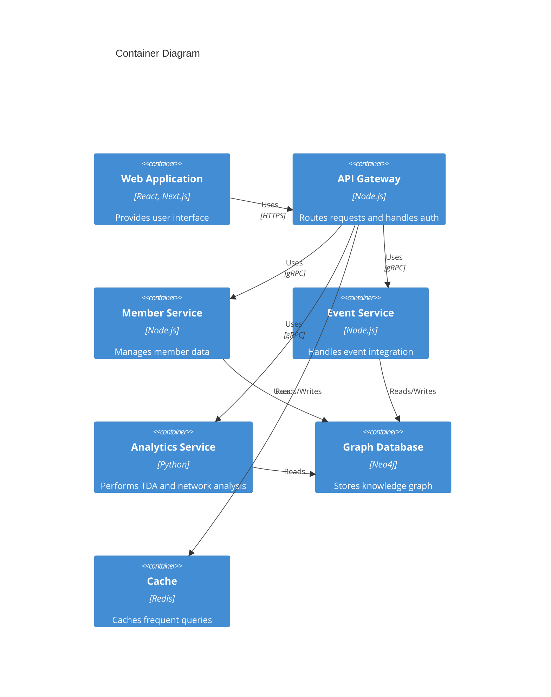
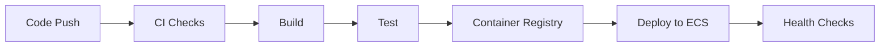

# Community Management Platform

[](https://github.com/organization/community-platform/actions)
[](LICENSE)
[](https://github.com/organization/community-platform/security)

Enterprise-grade platform for managing and analyzing community data through advanced graph database technology and network analysis.

## Overview

The Community Management Platform revolutionizes how organizations understand and manage their community relationships through:

- Advanced graph database technology for complex relationship modeling
- Topological Data Analysis (TDA) for deep network insights
- Automated entity disambiguation and profile management
- Comprehensive event platform integration
- Interactive network visualization

## System Architecture



## Prerequisites

- Node.js >= 18.0.0
- pnpm >= 8.0.0
- Docker >= 24.0.0
- Docker Compose >= 2.20.0
- Neo4j Enterprise License
- AWS Account with appropriate permissions

## Getting Started

1. Clone the repository:
```bash
git clone https://github.com/organization/community-platform.git
cd community-platform
```

2. Install dependencies:
```bash
pnpm install
```

3. Configure environment variables:
```bash
cp .env.example .env
# Edit .env with your configuration
```

4. Start development environment:
```bash
pnpm run docker:up   # Start infrastructure containers
pnpm run dev        # Start all services in development mode
```

5. Verify the setup:
```bash
curl http://localhost:3000/health  # API Gateway health check
```

## Project Structure

```
├── src/
│   ├── web/              # Next.js frontend application
│   ├── backend/          # Microservices backend
│   │   ├── api-gateway/  # API Gateway service
│   │   ├── member-service/  # Member management service
│   │   ├── event-service/   # Event integration service
│   │   ├── analytics-service/  # TDA computation service
│   │   └── shared/      # Shared utilities and types
│   └── docs/            # Documentation
├── docker-compose.yml   # Container orchestration
└── package.json        # Workspace configuration
```

## Development

### Available Scripts

- `pnpm dev` - Start development environment
- `pnpm build` - Build all services
- `pnpm test` - Run tests
- `pnpm lint` - Run linting
- `pnpm format` - Format code
- `pnpm clean` - Clean build artifacts

### Service Ports

- Web Frontend: 3000
- API Gateway: 3000
- Member Service: 4000
- Event Service: 4001
- Analytics Service: 5000
- Neo4j: 7474 (HTTP), 7687 (Bolt)
- Redis: 6379

## Security

### Authentication

- JWT-based authentication via Clerk
- Role-based access control
- Social login integration (LinkedIn, Gmail)
- Secure credential management

### Data Protection

- Encryption at rest and in transit
- PII data handling compliance
- Regular security audits
- GDPR compliance tools

## Deployment

### Infrastructure

- AWS ECS for container orchestration
- CloudFront for CDN
- Route 53 for DNS management
- ACM for SSL certificates

### CI/CD Pipeline



## Monitoring

### Health Checks

Each service exposes a `/health` endpoint providing:
- Service status
- Dependency health
- Resource utilization
- Response times

### Metrics

- Prometheus metrics collection
- Custom business metrics
- Performance monitoring
- Resource utilization tracking

## Contributing

1. Fork the repository
2. Create a feature branch
3. Commit changes
4. Submit pull request

Follow the coding standards:
- ESLint configuration
- Prettier formatting
- Test coverage requirements
- Documentation updates

## License

Private and Confidential - Community Platform Team