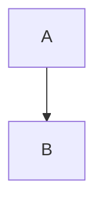
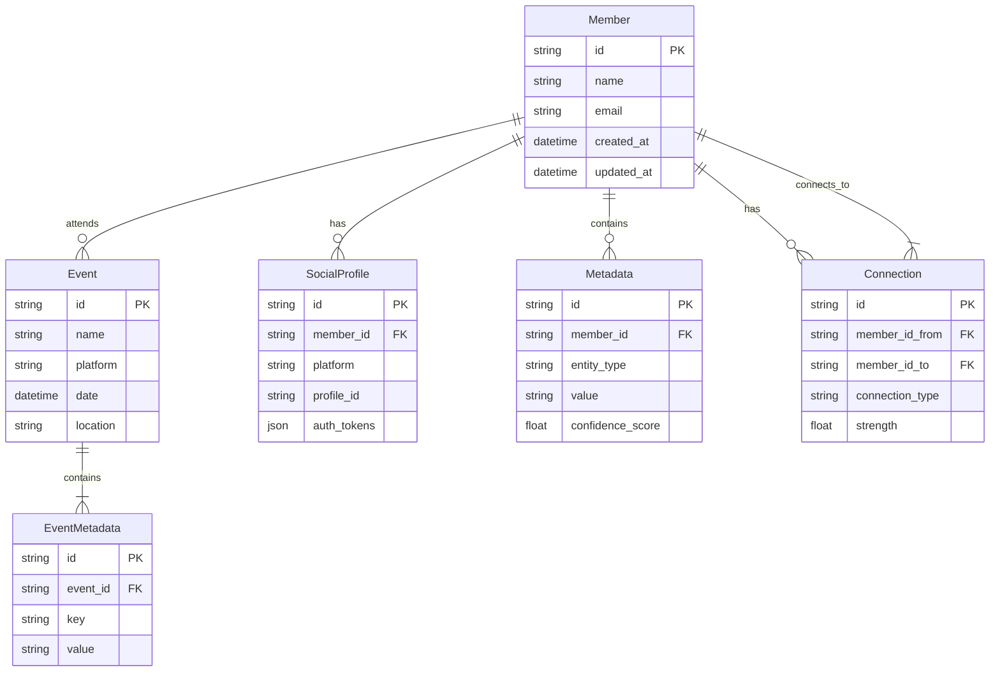
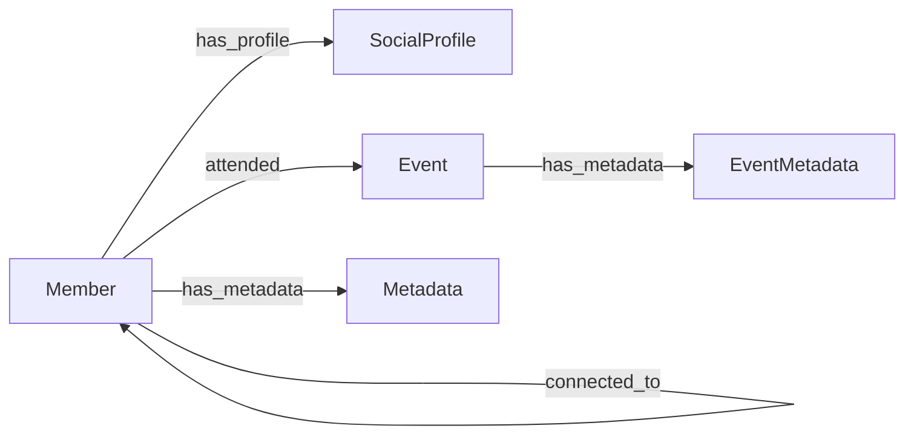
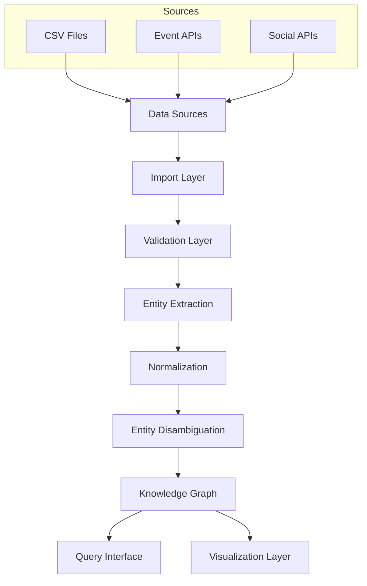

# Product Requirements Document (PRD)

# 1. INTRODUCTION

## 1.1 Purpose

This Product Requirements Document (PRD) specifies the requirements for a community management platform that leverages graph database technology and advanced data analysis techniques. The document is intended for:

- Development team members
- Project stakeholders
- System architects
- UX/UI designers
- Quality assurance teams
- Product managers

## 1.2 Scope

The system is a comprehensive community management platform that consists of two main components:

1. Admin Dashboard
- Member management and oversight
- Knowledge graph query interface
- Data import and normalization tools
- Entity disambiguation system
- Analytics visualization modules

2. Member Dashboard
- Authentication system with multiple providers (Clerk API)
- Social integration (LinkedIn, Gmail)
- Event data management (Luma, Eventbrite, Partiful)
- Network visualization interface
- Topological Data Analysis (TDA) interactive module

Core functionalities include:
- Entity extraction and metadata processing
- Data normalization and member identification
- Knowledge graph construction and querying
- High-dimensional semantic embedding visualization
- Topological data analysis with configurable parameters
- Graph database integration
- Interactive visualizations using Framer Motion

The platform aims to provide a robust solution for community data management while offering advanced analytical capabilities through network analysis and topological approaches.

# 2. PRODUCT DESCRIPTION

## 2.1 Product Perspective

The community management platform operates as a standalone system that integrates with multiple external services and APIs:

- Authentication Layer: Clerk API for identity management
- Social Integration Layer: LinkedIn and Gmail APIs
- Event Management Layer: Luma, Eventbrite, and Partiful integrations
- Database Layer: Graph database for knowledge storage and querying
- Visualization Layer: Framer Motion for interactive displays

The system architecture follows a modular design with clear separation between admin and member functionalities while maintaining data consistency across all components.

## 2.2 Product Functions

- User Authentication and Authorization
  - Multi-provider authentication through Clerk API
  - Role-based access control (admin/member)
  - Social account linking

- Data Management
  - Automated entity extraction from member data
  - CSV file processing and normalization
  - Entity disambiguation using NLP techniques
  - Knowledge graph construction and maintenance

- Event Integration
  - API-based event data synchronization
  - CSV import functionality for event records
  - Event metadata processing and entity linking

- Analytics and Visualization
  - Interactive network graph visualization
  - High-dimensional semantic embedding display
  - Topological Data Analysis (TDA) with configurable parameters
  - Real-time graph querying and exploration

## 2.3 User Characteristics

1. Community Administrators
   - Technical proficiency: Intermediate to Advanced
   - Primary tasks: Member oversight, data management, analytics review
   - Access level: Full system access with management privileges

2. Community Members
   - Technical proficiency: Basic to Intermediate
   - Primary tasks: Profile management, network exploration, event participation
   - Access level: Limited to member dashboard features

3. Data Analysts
   - Technical proficiency: Advanced
   - Primary tasks: Network analysis, TDA configuration, insight generation
   - Access level: Advanced analytics features

## 2.4 Constraints

1. Technical Constraints
   - Must maintain compatibility with Clerk API authentication system
   - Graph database performance limitations for large-scale queries
   - Browser compatibility requirements for Framer Motion animations

2. Integration Constraints
   - API rate limits from third-party services
   - Data format variations between event platforms
   - Real-time synchronization limitations

3. Security Constraints
   - Data privacy compliance requirements
   - Secure storage of social authentication tokens
   - Access control enforcement

## 2.5 Assumptions and Dependencies

Assumptions:
- Users have modern web browsers supporting required JavaScript features
- Community members maintain active social media profiles
- Stable internet connectivity for real-time features
- Basic understanding of network visualization concepts

Dependencies:
- Clerk API availability and functionality
- Third-party event platform API stability
- Graph database service uptime
- Social platform API access and permissions
- Framer Motion library compatibility
- NLP processing capabilities for entity disambiguation

# 3. PROCESS FLOWCHART

# 4. FUNCTIONAL REQUIREMENTS

## 4.1 Authentication System (F1)

### Description
Authentication system powered by Clerk API with social login capabilities.

### Priority
High

### Requirements

| ID | Requirement | Priority |
|---|---|---|
| F1.1 | Implement Clerk API integration for user authentication | High |
| F1.2 | Enable LinkedIn OAuth login flow | High |
| F1.3 | Enable Gmail OAuth login flow | High |
| F1.4 | Store and manage authentication tokens securely | High |
| F1.5 | Handle session management and token refresh | Medium |

## 4.2 Data Import and Processing (F2)

### Description
System for importing and processing member data from various sources.

### Priority
High

### Requirements

| ID | Requirement | Priority |
|---|---|---|
| F2.1 | CSV file upload functionality for event data | High |
| F2.2 | API integration with Luma for event data | High |
| F2.3 | API integration with Eventbrite for event data | High |
| F2.4 | API integration with Partiful for event data | High |
| F2.5 | Metadata extraction from imported data | High |
| F2.6 | Entity recognition and extraction system | High |

## 4.3 Data Normalization and Entity Management (F3)

### Description
System for normalizing data and managing entity relationships.

### Priority
High

### Requirements

| ID | Requirement | Priority |
|---|---|---|
| F3.1 | Implement entity disambiguation using NLP | High |
| F3.2 | Create unique identifier system for members | High |
| F3.3 | Normalize data fields across different sources | High |
| F3.4 | Build and maintain knowledge graph relationships | High |
| F3.5 | Handle entity merging and deduplication | Medium |

## 4.4 Network Visualization (F4)

### Description
Interactive visualization system for network data using Framer Motion.

### Priority
Medium

### Requirements

| ID | Requirement | Priority |
|---|---|---|
| F4.1 | Implement high-dimensional semantic embedding visualization | High |
| F4.2 | Create interactive network graph interface | High |
| F4.3 | Enable zoom and pan controls | Medium |
| F4.4 | Provide node and edge filtering capabilities | Medium |
| F4.5 | Implement search and highlight functionality | Medium |

## 4.5 Topological Data Analysis Module (F5)

### Description
TDA system with configurable parameters and visualization.

### Priority
Medium

### Requirements

| ID | Requirement | Priority |
|---|---|---|
| F5.1 | Implement TDA algorithm integration | High |
| F5.2 | Create parameter input interface | High |
| F5.3 | Generate real-time TDA visualizations | High |
| F5.4 | Enable parameter adjustment and result updates | Medium |
| F5.5 | Provide TDA result export functionality | Low |

## 4.6 Admin Dashboard (F6)

### Description
Administrative interface for community management.

### Priority
High

### Requirements

| ID | Requirement | Priority |
|---|---|---|
| F6.1 | Implement member management interface | High |
| F6.2 | Create knowledge graph query system | High |
| F6.3 | Provide analytics dashboard | Medium |
| F6.4 | Enable bulk member actions | Medium |
| F6.5 | Implement audit logging system | Low |

## 4.7 Member Dashboard (F7)

### Description
User interface for community members.

### Priority
High

### Requirements

| ID | Requirement | Priority |
|---|---|---|
| F7.1 | Create profile management interface | High |
| F7.2 | Implement network exploration tools | High |
| F7.3 | Display personalized event data | Medium |
| F7.4 | Enable social connection management | Medium |
| F7.5 | Provide personal analytics view | Low |

# 5. NON-FUNCTIONAL REQUIREMENTS

## 5.1 Performance Requirements

| Requirement | Description | Target Metric |
|------------|-------------|---------------|
| Response Time | Maximum time for page loads and data retrieval | < 2 seconds |
| Graph Query Performance | Knowledge graph query execution time | < 1 second for basic queries |
| Visualization Rendering | Network graph and TDA visualization loading | < 3 seconds |
| API Integration Response | Third-party API call completion time | < 4 seconds |
| Concurrent Users | Number of simultaneous users supported | 1000 users |
| Data Processing | Batch import processing time | < 5 minutes for 10MB CSV |

## 5.2 Safety Requirements

| Requirement | Description |
|------------|-------------|
| Data Backup | Automated daily backups of graph database |
| Failure Recovery | System state recovery within 4 hours of failure |
| Data Validation | Input validation for all data import processes |
| Error Handling | Graceful degradation of services during partial system failure |
| State Management | Automatic save points for long-running operations |
| Rollback Capability | Transaction rollback for failed data operations |

## 5.3 Security Requirements

| Requirement | Description |
|------------|-------------|
| Authentication | Multi-factor authentication through Clerk API |
| Authorization | Role-based access control (RBAC) system |
| Data Encryption | AES-256 encryption for data at rest |
| SSL/TLS | TLS 1.3 for all data in transit |
| Token Management | Secure storage and rotation of API tokens |
| Session Control | Automatic session timeout after 30 minutes of inactivity |
| Access Logging | Comprehensive audit trail of system access |

## 5.4 Quality Requirements

### 5.4.1 Availability
- System uptime: 99.9%
- Planned maintenance windows: Maximum 4 hours monthly
- Redundancy for critical components
- Real-time system status monitoring

### 5.4.2 Maintainability
- Modular architecture for component isolation
- Comprehensive API documentation
- Automated deployment pipeline
- Version control for all code and configurations

### 5.4.3 Usability
- Mobile-responsive design
- Maximum 3 clicks to reach any feature
- Consistent UI patterns across all interfaces
- Accessibility compliance with WCAG 2.1 Level AA

### 5.4.4 Scalability
- Horizontal scaling capability for database layer
- Auto-scaling based on system load
- Support for data growth up to 1TB
- Microservices architecture for independent scaling

### 5.4.5 Reliability
- Maximum 1 hour of unplanned downtime per month
- Automated system health checks every 5 minutes
- Data consistency checks after every import
- Automatic failover for critical services

## 5.5 Compliance Requirements

| Requirement | Description |
|------------|-------------|
| Data Privacy | GDPR and CCPA compliance |
| Data Retention | Configurable data retention policies |
| User Consent | Explicit consent management system |
| API Compliance | OAuth 2.0 compliance for all integrations |
| Accessibility | WCAG 2.1 Level AA compliance |
| Documentation | API documentation following OpenAPI 3.0 specification |
| Audit Trail | Complete audit logging for compliance reporting |

# 6. DATA REQUIREMENTS

## 6.1 Data Models

### 6.1.1 Entity Relationship Diagram

### 6.1.2 Knowledge Graph Schema

## 6.2 Data Storage

### 6.2.1 Primary Storage
- Graph database for knowledge graph and relationship data
- Document store for member profiles and event details
- Key-value store for session data and caching

### 6.2.2 Data Retention
- Member data: Retained indefinitely while account is active
- Event data: 5-year retention period
- Authentication tokens: Retained until explicitly revoked
- Audit logs: 2-year retention period
- Backup data: 90-day retention cycle

### 6.2.3 Redundancy and Backup
- Real-time replication across multiple geographic regions
- Daily incremental backups
- Weekly full backups
- Monthly archive snapshots
- Point-in-time recovery capability up to 30 days

### 6.2.4 Recovery Procedures
- Automated failover for primary database instance
- Manual recovery process for point-in-time restoration
- Disaster recovery plan with RPO of 1 hour and RTO of 4 hours

## 6.3 Data Processing

### 6.3.1 Data Flow

### 6.3.2 Data Security
- Field-level encryption for sensitive data
- Data masking for non-administrative users
- Encryption at rest using AES-256
- TLS 1.3 for data in transit
- Access control lists for graph database queries
- Automated PII detection and protection

### 6.3.3 Processing Requirements
- Real-time entity extraction and linking
- Batch processing for CSV imports
- Asynchronous processing for large-scale operations
- Rate limiting for API-based imports
- Configurable processing rules for entity disambiguation
- Parallel processing for TDA computations

# 7. EXTERNAL INTERFACES

## 7.1 User Interfaces

### 7.1.1 Admin Dashboard Interface

| Component | Description |
|-----------|-------------|
| Member Management View | Tabular view with filtering and sorting capabilities |
| Knowledge Graph Query Interface | Interactive query builder with visual feedback |
| Data Import Interface | Drag-and-drop file upload area with progress indicators |
| Analytics Dashboard | Card-based layout with Framer Motion transitions |
| Entity Management Interface | Split-view for entity disambiguation and merging |

### 7.1.2 Member Dashboard Interface

| Component | Description |
|-----------|-------------|
| Profile Management | Form-based interface with real-time validation |
| Network Visualization | Interactive canvas using Framer Motion for animations |
| TDA Parameter Controls | Slider-based controls with immediate visual feedback |
| Event Integration Panel | OAuth connection buttons and import progress tracking |
| Search Interface | Type-ahead search with entity highlighting |

## 7.2 Software Interfaces

### 7.2.1 Authentication Services

| Interface | Specification |
|-----------|---------------|
| Clerk API | REST API, OAuth 2.0, JWT tokens |
| LinkedIn OAuth | OAuth 2.0, REST API v2 |
| Gmail OAuth | Google OAuth 2.0, Gmail API v1 |

### 7.2.2 Event Platform Integrations

| Platform | Interface Type | Protocol | Data Format |
|----------|---------------|-----------|-------------|
| Luma | REST API | HTTPS | JSON |
| Eventbrite | REST API | HTTPS | JSON |
| Partiful | REST API | HTTPS | JSON |

### 7.2.3 Database Interfaces

| Component | Interface Type | Protocol |
|-----------|---------------|-----------|
| Graph Database | Native API | Bolt Protocol |
| Cache Layer | Redis Protocol | TCP |
| Document Store | REST API | HTTPS |

## 7.3 Communication Interfaces

### 7.3.1 Network Protocols

| Protocol | Usage | Port |
|----------|-------|------|
| HTTPS | All API communications | 443 |
| WebSocket | Real-time updates | 443 |
| GraphQL | Knowledge graph queries | 443 |

### 7.3.2 Data Formats

| Format | Usage |
|--------|-------|
| JSON | API responses and requests |
| CSV | Data import/export |
| GraphQL | Query language for graph database |
| JWT | Authentication tokens |

### 7.3.3 API Endpoints

| Endpoint Category | Rate Limit | Authentication |
|------------------|------------|----------------|
| Member API | 100 req/min | JWT |
| Event API | 50 req/min | OAuth 2.0 |
| Graph API | 200 req/min | JWT |
| Analytics API | 30 req/min | JWT |

# 8. APPENDICES

## 8.1 GLOSSARY

| Term | Definition |
|------|------------|
| Entity Disambiguation | The process of determining which real-world entity a reference in text refers to when multiple entities could be referenced |
| Knowledge Graph | A structured representation of information using nodes (entities) and edges (relationships) to store and query interconnected data |
| Semantic Embedding | A technique that maps words, phrases, or entities to vectors in a high-dimensional space where similar items are closer together |
| Topological Data Analysis | A method for analyzing complex data using techniques from topology to find shape-based patterns in high-dimensional data |
| Graph Database | A database that uses graph structures with nodes, edges, and properties to represent and store data |
| Entity Extraction | The process of identifying and classifying key elements from text into predefined categories |
| OAuth | An open standard for access delegation, commonly used for secure authorization in web applications |

## 8.2 ACRONYMS

| Acronym | Full Form |
|---------|-----------|
| API | Application Programming Interface |
| CSV | Comma-Separated Values |
| GDPR | General Data Protection Regulation |
| JWT | JSON Web Token |
| NLP | Natural Language Processing |
| OAuth | Open Authorization |
| PII | Personally Identifiable Information |
| REST | Representational State Transfer |
| RPO | Recovery Point Objective |
| RTO | Recovery Time Objective |
| TDA | Topological Data Analysis |
| TLS | Transport Layer Security |
| UI/UX | User Interface/User Experience |
| WCAG | Web Content Accessibility Guidelines |

## 8.3 ADDITIONAL REFERENCES

| Resource | Description | URL |
|----------|-------------|-----|
| Clerk Documentation | Official documentation for Clerk authentication | https://clerk.dev/docs |
| Framer Motion | Animation library documentation | https://www.framer.com/motion/ |
| LinkedIn OAuth 2.0 | OAuth implementation guide | https://learn.microsoft.com/en-us/linkedin/shared/authentication/authorization-code-flow |
| Gmail API | Google API documentation | https://developers.google.com/gmail/api |
| Luma API | Event platform integration guide | https://lu.ma/developers |
| Eventbrite API | Event platform documentation | https://www.eventbrite.com/platform/api |
| TDA Resources | Stanford's computational topology group | https://comptop.stanford.edu/ |