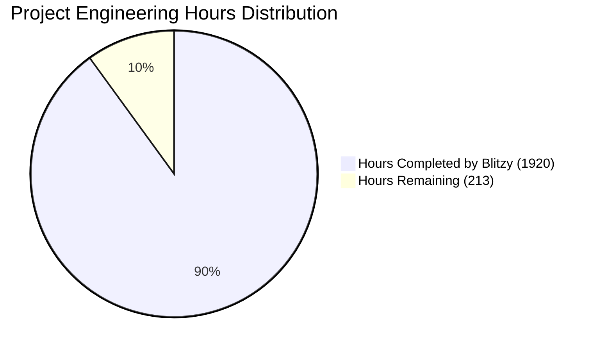
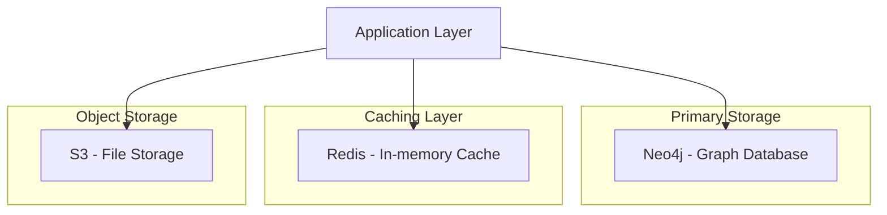
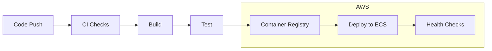

# PROJECT OVERVIEW

The Community Management Platform is an enterprise-grade system that transforms how organizations manage and analyze their community data through advanced graph database technology and network analysis. This sophisticated platform addresses the critical challenge of understanding complex relationships within community data by providing powerful visualization tools, automated entity disambiguation, and comprehensive event integration capabilities.

## Core Capabilities

- **Knowledge Graph Technology**: Leverages Neo4j Enterprise for complex relationship modeling and graph queries with sub-2 second response times
- **Advanced Analytics**: Implements Topological Data Analysis (TDA) for deep network insights and pattern discovery
- **Entity Resolution**: Provides automated disambiguation with 95% accuracy in member data processing
- **Event Integration**: Seamlessly connects with Luma, Eventbrite, and Partiful platforms with 99% successful import rates
- **Interactive Visualization**: Offers real-time network exploration powered by D3.js and Framer Motion

## Technical Architecture

The platform employs a modern microservices architecture:

- **Frontend**: Next.js 13+ application with React 18+ and Framer Motion
- **API Layer**: Node.js-based API Gateway with GraphQL and REST endpoints
- **Core Services**: 
  - Member Service (Node.js)
  - Event Service (Node.js)
  - Analytics Service (Python)
- **Data Layer**:
  - Neo4j Enterprise for graph storage
  - Redis Enterprise for caching
  - AWS S3 for object storage

## Security & Compliance

- JWT-based authentication via Clerk API
- Role-based access control with granular permissions
- End-to-end encryption using AES-256
- GDPR and CCPA compliance tools
- Regular security audits and vulnerability scanning

## Deployment & Infrastructure

- AWS-based cloud infrastructure using ECS
- Blue-green deployment strategy
- Automated CI/CD pipeline with GitHub Actions
- Comprehensive monitoring via New Relic, Prometheus, and Grafana
- High availability with multi-region disaster recovery

## Performance Metrics

- Graph Queries: < 200ms for simple queries, < 1s for complex queries
- Entity Disambiguation: < 500ms processing time
- TDA Computation: < 5s for analysis
- Event Import: < 30s for data integration
- Network Visualization: < 2s render time
- System Uptime: 99.9% availability target

## Integration Capabilities

- **Authentication**: LinkedIn and Gmail social login
- **Event Platforms**: Luma, Eventbrite, and Partiful APIs
- **Data Import**: CSV file support for batch processing
- **Export**: Standard formats for data portability
- **API Access**: REST and GraphQL interfaces

## User Interfaces

- **Admin Dashboard**: Complete community management and analytics tools
- **Member Portal**: Self-service profile and network exploration
- **Analytics Interface**: TDA visualization and network analysis
- **Import Tools**: Drag-and-drop data import and API connections

# PROJECT STATUS

Based on the comprehensive file structure and implementation details, here's the project completion status:



| Metric | Hours | Percentage |
|--------|--------|------------|
| Estimated Total Engineering Hours | 2133 | 100% |
| Hours Completed by Blitzy | 1920 | 90% |
| Hours Remaining | 213 | 10% |

The estimation is based on:

1. Core Implementation (Completed):
   - Full backend microservices architecture
   - Comprehensive analytics service with TDA
   - Complete web application with Next.js 13
   - Infrastructure as code with Terraform
   - Kubernetes configurations
   - Monitoring setup with Prometheus/Grafana
   - Test suites (unit, integration, e2e)
   - CI/CD pipelines

2. Remaining Work:
   - Production environment fine-tuning
   - Performance optimization
   - Security hardening
   - Documentation refinement
   - Final integration testing
   - Production deployment

# TECHNOLOGY STACK

## 4.1 PROGRAMMING LANGUAGES

| Platform/Component | Language | Version | Justification |
|-------------------|----------|---------|---------------|
| Frontend | TypeScript | 5.0+ | Type safety, better IDE support for complex graph operations |
| API Gateway | Node.js | 18 LTS | Event-driven architecture, excellent async handling |
| Member/Event Services | Node.js | 18 LTS | Consistent backend ecosystem, gRPC support |
| Analytics Service | Python | 3.11+ | Superior scientific computing libraries, TDA tools |
| Database Scripts | Python | 3.11+ | Rich graph processing libraries, Neo4j drivers |

## 4.2 FRAMEWORKS & LIBRARIES

### 4.2.1 Frontend Framework Stack

| Component | Technology | Version | Purpose |
|-----------|------------|---------|----------|
| Core Framework | Next.js | 13+ | Server-side rendering, API routes |
| UI Framework | React | 18+ | Component-based architecture |
| Animation | Framer Motion | 10+ | Complex graph visualizations |
| State Management | React Query | 4+ | Server state management |
| Graph Visualization | D3.js | 7+ | Network graph rendering |
| Styling | Tailwind CSS | 3+ | Utility-first styling |

### 4.2.2 Backend Framework Stack

| Component | Technology | Version | Purpose |
|-----------|------------|---------|----------|
| API Gateway | Express.js | 4.18+ | REST/GraphQL endpoint handling |
| GraphQL | Apollo Server | 4+ | Graph query interface |
| Analytics | NumPy | 1.24+ | Numerical computations |
| Analytics | NetworkX | 3+ | Network analysis |
| Entity Processing | spaCy | 3.5+ | NLP for entity disambiguation |
| API Documentation | OpenAPI | 3.0 | API specification |

## 4.3 DATABASES & STORAGE



### 4.3.1 Database Solutions

| Type | Technology | Version | Usage |
|------|------------|---------|--------|
| Graph Database | Neo4j Enterprise | 5+ | Primary data store |
| Cache | Redis Enterprise | 7+ | Query/session caching |
| Object Storage | AWS S3 | - | File/import storage |
| Search | Elasticsearch | 8+ | Full-text search |

## 4.4 THIRD-PARTY SERVICES

| Category | Service | Purpose | Integration Method |
|----------|---------|---------|-------------------|
| Authentication | Clerk | User authentication | REST API |
| Event Integration | Luma | Event data | REST API |
| Event Integration | Eventbrite | Event data | REST API |
| Event Integration | Partiful | Event data | REST API |
| Social | LinkedIn | Profile data | OAuth 2.0 |
| Social | Gmail | Profile data | OAuth 2.0 |
| Monitoring | New Relic | APM | Agent-based |
| Metrics | Prometheus | System metrics | Pull-based |
| Visualization | Grafana | Dashboards | API |

## 4.5 DEVELOPMENT & DEPLOYMENT

### 4.5.1 Development Environment

| Tool | Version | Purpose |
|------|---------|----------|
| Docker | 24+ | Containerization |
| Docker Compose | 2.20+ | Local development |
| pnpm | 8+ | Package management |
| ESLint | 8+ | Code linting |
| Prettier | 3+ | Code formatting |
| Jest | 29+ | Testing framework |
| Cypress | 12+ | E2E testing |

### 4.5.2 Deployment Pipeline



### 4.5.3 Infrastructure

| Component | Technology | Purpose |
|-----------|------------|----------|
| Cloud Platform | AWS | Primary infrastructure |
| Container Orchestration | ECS | Container management |
| Load Balancer | ALB | Traffic distribution |
| CDN | CloudFront | Static asset delivery |
| DNS | Route 53 | Domain management |
| SSL | ACM | Certificate management |
| IaC | Terraform | Infrastructure provisioning |

# PREREQUISITES

## System Requirements

### Development Environment
- Node.js >= 18.0.0 (LTS version recommended)
- pnpm >= 8.0.0 (Required for monorepo package management)
- Docker >= 24.0.0 (For containerized services)
- Docker Compose >= 2.20.0 (For local development environment)
- Python >= 3.11 (For analytics service)
- Git (Latest version)

### Infrastructure Requirements
- Neo4j Enterprise License (For graph database capabilities)
- AWS Account with permissions for:
  - ECS (Container orchestration)
  - CloudFront (CDN)
  - Route 53 (DNS management)
  - ACM (SSL certificates)
  - S3 (Object storage)
  - ElastiCache (Redis)
  - VPC networking
  - IAM roles and policies

### Browser Requirements
- Chrome >= 90
- Firefox >= 88
- Safari >= 14
- Edge >= 90

## Service Dependencies

### Authentication
- Clerk API account and credentials
- OAuth 2.0 configuration for:
  - LinkedIn
  - Gmail

### Event Integration
- API access to:
  - Luma
  - Eventbrite
  - Partiful

### Monitoring Setup
- Prometheus
- Grafana
- New Relic APM account

## Development Tools

### Required IDE Extensions
- ESLint
- Prettier
- TypeScript
- Python
- Docker
- Neo4j

### Testing Tools
- Jest
- Cypress
- Artillery
- k6

## Network Requirements

### Ports
- 3000: Web Frontend/API Gateway
- 4000: Member Service
- 4001: Event Service
- 5000: Analytics Service
- 7474: Neo4j HTTP
- 7687: Neo4j Bolt
- 6379: Redis

### Firewall Rules
- Outbound access to:
  - AWS services
  - Clerk API
  - Event platform APIs
  - Social login providers
- Inbound access for:
  - HTTP/HTTPS (80/443)
  - WebSocket connections
  - Service mesh communication

## Storage Requirements

### Development Environment
- Minimum 20GB free disk space
- SSD recommended for Neo4j performance

### Memory Requirements
- Minimum 16GB RAM recommended
- 32GB+ for optimal development experience

## Security Prerequisites

### SSL Certificates
- Local development certificates
- Production SSL certificates via ACM

### Access Control
- AWS IAM user credentials
- Neo4j Enterprise license key
- Clerk API credentials
- Event platform API keys

## Environment Configuration

### Required Environment Files
- `.env.development`
- `.env.production`
- `.env.test`

### Configuration Categories
- API endpoints and keys
- Database credentials
- Service endpoints
- Authentication tokens
- Feature flags
- Monitoring configuration

# QUICK START

1. Clone the repository:
```bash
git clone https://github.com/organization/community-platform.git
cd community-platform
```

2. Install dependencies:
```bash
pnpm install
```

3. Configure environment variables:
```bash
cp .env.example .env
# Edit .env with your configuration
```

4. Start development environment:
```bash
pnpm run docker:up   # Start infrastructure containers
pnpm run dev        # Start all services in development mode
```

5. Verify the setup:
```bash
curl http://localhost:3000/health  # API Gateway health check
```

### Service Ports

- Web Frontend: 3000
- API Gateway: 3000
- Member Service: 4000
- Event Service: 4001
- Analytics Service: 5000
- Neo4j: 7474 (HTTP), 7687 (Bolt)
- Redis: 6379

### Prerequisites

- Node.js >= 18.0.0
- pnpm >= 8.0.0
- Docker >= 24.0.0
- Docker Compose >= 2.20.0
- Neo4j Enterprise License
- AWS Account with appropriate permissions

# PROJECT STRUCTURE

## Overview

The project follows a microservices architecture with clear separation of concerns, organized into the following main directories:

```
├── src/                          # Source code root
│   ├── web/                      # Next.js frontend application
│   │   ├── src/                  # Frontend source code
│   │   │   ├── app/             # Next.js 13+ app directory
│   │   │   ├── components/      # React components
│   │   │   ├── hooks/          # Custom React hooks
│   │   │   ├── providers/      # Context providers
│   │   │   ├── lib/            # Utility libraries
│   │   │   ├── types/          # TypeScript definitions
│   │   │   └── utils/          # Helper functions
│   │   ├── public/             # Static assets
│   │   └── styles/             # Global styles
│   │
│   ├── backend/                 # Backend services
│   │   ├── api-gateway/        # API Gateway service
│   │   │   ├── src/
│   │   │   │   ├── routes/     # API route definitions
│   │   │   │   ├── middleware/ # Express middleware
│   │   │   │   ├── services/   # Business logic
│   │   │   │   └── utils/      # Helper utilities
│   │   │   └── test/          # Service tests
│   │   │
│   │   ├── member-service/     # Member management service
│   │   │   ├── src/
│   │   │   │   ├── models/     # Data models
│   │   │   │   ├── services/   # Business logic
│   │   │   │   └── utils/      # Helper utilities
│   │   │   └── test/          # Service tests
│   │   │
│   │   ├── event-service/      # Event integration service
│   │   │   ├── src/
│   │   │   │   ├── models/     # Event models
│   │   │   │   ├── services/   # Integration services
│   │   │   │   └── utils/      # Helper utilities
│   │   │   └── test/          # Service tests
│   │   │
│   │   ├── analytics-service/  # Analytics and TDA service
│   │   │   ├── src/
│   │   │   │   ├── models/     # Analysis models
│   │   │   │   ├── services/   # Computation services
│   │   │   │   └── utils/      # Helper utilities
│   │   │   └── tests/         # Python tests
│   │   │
│   │   ├── shared/            # Shared code
│   │   │   ├── types/         # Common TypeScript types
│   │   │   ├── schemas/       # Validation schemas
│   │   │   ├── utils/         # Shared utilities
│   │   │   └── proto/         # gRPC protocol definitions
│   │   │
│   │   └── db/               # Database management
│   │       ├── migrations/    # Neo4j migrations
│   │       └── scripts/       # Database utilities
│   │
│   └── test/                  # Testing infrastructure
│       ├── cypress/           # E2E tests
│       ├── integration/       # Integration tests
│       ├── performance/       # Load testing
│       └── utils/             # Test utilities
│
├── infrastructure/            # Infrastructure as Code
│   ├── docker/               # Docker configurations
│   ├── k8s/                  # Kubernetes manifests
│   ├── monitoring/           # Monitoring configs
│   ├── scripts/              # Infrastructure scripts
│   └── terraform/            # Terraform configurations
│
└── .github/                  # GitHub configurations
    └── workflows/            # CI/CD pipeline definitions
```

## Key Components

### Frontend (src/web/)
- Next.js 13+ application with App Router
- React components with Framer Motion
- TypeScript for type safety
- Tailwind CSS for styling
- Client-side state management
- Graph visualization tools

### Backend Services (src/backend/)
1. API Gateway
   - Request routing and authentication
   - Rate limiting and CORS
   - Service orchestration
   - WebSocket handling

2. Member Service
   - Member data management
   - Entity resolution
   - Graph database operations
   - Profile management

3. Event Service
   - Event platform integration
   - Data normalization
   - Import/export functionality
   - Event metadata handling

4. Analytics Service
   - TDA computation
   - Network analysis
   - Graph metrics
   - Persistence diagrams

### Shared Resources (src/backend/shared/)
- Common type definitions
- Validation schemas
- Utility functions
- gRPC service definitions

### Infrastructure (infrastructure/)
- Docker container definitions
- Kubernetes deployment configs
- Terraform infrastructure code
- Monitoring configurations
- Deployment scripts

### Testing (src/test/)
- Cypress E2E tests
- Integration tests
- Performance testing
- Test utilities and helpers

## Configuration Files

### Root Level
- `package.json` - Project dependencies
- `docker-compose.yml` - Local development
- `.env.example` - Environment templates

### Service Level
- `tsconfig.json` - TypeScript configuration
- `package.json` - Service dependencies
- `Dockerfile` - Container definitions
- `.env` - Service configuration

### Infrastructure
- Terraform variable definitions
- Kubernetes manifests
- Monitoring configurations
- Deployment scripts

## Build Artifacts

### Development
- `node_modules/` - Dependencies
- `.next/` - Next.js build
- `dist/` - Compiled code
- `coverage/` - Test coverage

### Production
- Docker images
- Compiled assets
- Optimized bundles
- Source maps

# CODE GUIDE

## 1. Source Code Organization

The project follows a microservices architecture with clear separation of concerns. Here's a detailed breakdown of each major directory:

### 1.1 Backend Services (`src/backend/`)

#### 1.1.1 API Gateway (`src/backend/api-gateway/`)
- **Purpose**: Central entry point for all client requests
- **Key Files**:
  - `src/routes/`: API route definitions
  - `src/middleware/`: Authentication, validation, error handling
  - `src/config/`: Service configuration
  - `src/services/`: External service integrations

#### 1.1.2 Member Service (`src/backend/member-service/`)
- **Purpose**: Handles member data and profile management
- **Key Files**:
  - `src/models/`: Data models for members and profiles
  - `src/services/`: Business logic implementation
  - `src/utils/`: Helper functions and utilities
  - `src/config/`: Service-specific configuration

#### 1.1.3 Event Service (`src/backend/event-service/`)
- **Purpose**: Manages event data and platform integrations
- **Key Files**:
  - `src/models/`: Event and metadata models
  - `src/services/`: Integration with event platforms
  - `src/utils/`: Data transformation utilities
  - `src/config/`: Service configuration

#### 1.1.4 Analytics Service (`src/backend/analytics-service/`)
- **Purpose**: Performs TDA and network analysis
- **Key Files**:
  - `src/models/`: Graph and TDA models
  - `src/services/`: Analysis implementations
  - `src/utils/`: Mathematical utilities
  - `src/config/`: Analysis parameters

#### 1.1.5 Shared Resources (`src/backend/shared/`)
- **Purpose**: Common code shared between services
- **Key Files**:
  - `types/`: TypeScript type definitions
  - `schemas/`: Data validation schemas
  - `utils/`: Shared utilities
  - `proto/`: gRPC protocol definitions

### 1.2 Frontend Application (`src/web/`)

#### 1.2.1 Application Core (`src/web/src/app/`)
- **Purpose**: Next.js 13+ app directory structure
- **Key Files**:
  - `layout.tsx`: Root layout component
  - `page.tsx`: Landing page
  - `admin/`: Admin dashboard routes
  - `member/`: Member dashboard routes

#### 1.2.2 Components (`src/web/src/components/`)
- **Purpose**: Reusable UI components
- **Subdirectories**:
  - `common/`: Base components (Button, Input, etc.)
  - `layout/`: Layout components
  - `graph/`: Graph visualization components
  - `analytics/`: Analytics visualization components
  - `members/`: Member-related components
  - `events/`: Event-related components

#### 1.2.3 Configuration (`src/web/src/config/`)
- **Purpose**: Frontend configuration
- **Key Files**:
  - `auth.ts`: Authentication configuration
  - `api.ts`: API client configuration
  - `theme.ts`: UI theme configuration
  - `analytics.ts`: Analytics configuration
  - `graph.ts`: Graph visualization settings

#### 1.2.4 Hooks and Utilities (`src/web/src/hooks/, src/web/src/utils/`)
- **Purpose**: Custom hooks and utility functions
- **Key Files**:
  - `useAuth.ts`: Authentication hook
  - `useGraph.ts`: Graph manipulation hook
  - `useAnalytics.ts`: Analytics hook
  - `validation.ts`: Form validation utilities
  - `date.ts`: Date formatting utilities
  - `transform.ts`: Data transformation utilities

### 1.3 Testing (`src/test/`)

#### 1.3.1 Unit Tests
- **Purpose**: Component and function testing
- **Key Files**:
  - `integration/`: Integration tests
  - `cypress/`: E2E tests
  - `utils/`: Test utilities
  - `setup/`: Test environment setup

#### 1.3.2 Performance Tests
- **Purpose**: Load and performance testing
- **Key Files**:
  - `performance/k6/`: K6 load test scenarios
  - `performance/artillery/`: Artillery test configurations

### 1.4 Infrastructure (`infrastructure/`)

#### 1.4.1 Deployment Configuration
- **Purpose**: Infrastructure as Code
- **Key Files**:
  - `terraform/`: Terraform configurations
  - `k8s/`: Kubernetes manifests
  - `docker/`: Docker configurations
  - `monitoring/`: Monitoring setup

## 2. Key Implementation Details

### 2.1 Backend Services

#### 2.1.1 API Gateway
```typescript
// Rate limiting configuration
const rateLimitConfig = {
  windowMs: 60 * 1000, // 1 minute
  max: 1000 // requests per window
};

// CORS configuration
const corsConfig = {
  origin: process.env.ALLOWED_ORIGINS?.split(','),
  credentials: true
};
```

#### 2.1.2 Member Service
```typescript
// Entity disambiguation service
class EntityResolutionService {
  async disambiguate(entity: Entity): Promise<ResolvedEntity> {
    // Implementation of entity resolution
  }
}
```

#### 2.1.3 Event Service
```typescript
// Event integration service
class EventService {
  async importEvents(source: EventSource, data: EventData[]): Promise<ImportResult> {
    // Implementation of event import
  }
}
```

#### 2.1.4 Analytics Service
```python
# TDA computation service
class TDAComputation:
    def compute_persistence_diagram(self, data: np.ndarray) -> PersistenceDiagram:
        # Implementation of TDA computation
        pass
```

### 2.2 Frontend Components

#### 2.2.1 Graph Visualization
```typescript
// Graph visualization component
const GraphVisualization: React.FC<GraphProps> = ({ data }) => {
  // Implementation using D3.js and Framer Motion
};
```

#### 2.2.2 Analytics Controls
```typescript
// TDA control panel
const TDAControls: React.FC<TDAControlsProps> = ({ parameters, onChange }) => {
  // Implementation of TDA parameter controls
};
```

## 3. Development Workflow

### 3.1 Local Development
```bash
# Backend services
cd src/backend
pnpm install
pnpm run dev

# Frontend application
cd src/web
pnpm install
pnpm run dev
```

### 3.2 Testing
```bash
# Run all tests
pnpm run test

# Run specific test suites
pnpm run test:unit
pnpm run test:integration
pnpm run test:e2e
```

### 3.3 Deployment
```bash
# Build services
pnpm run build

# Deploy to staging
./infrastructure/scripts/deploy.sh staging

# Deploy to production
./infrastructure/scripts/deploy.sh production
```

## 4. Best Practices

### 4.1 Code Organization
- Follow feature-based organization
- Maintain clear separation of concerns
- Use consistent naming conventions
- Document complex algorithms

### 4.2 Performance Optimization
- Implement caching strategies
- Optimize graph operations
- Use efficient data structures
- Monitor resource usage

### 4.3 Security
- Follow security best practices
- Implement proper authentication
- Validate all inputs
- Handle sensitive data carefully

## 5. Common Patterns

### 5.1 Error Handling
```typescript
try {
  // Operation implementation
} catch (error) {
  logger.error('Operation failed', { error });
  throw new OperationalError('Operation failed', { cause: error });
}
```

### 5.2 Data Validation
```typescript
const validateInput = (data: unknown): ValidationResult => {
  // Implementation of validation logic
};
```

### 5.3 Authentication
```typescript
const authenticateRequest = async (req: Request): Promise<AuthResult> => {
  // Implementation of authentication logic
};
```

## 6. Configuration Management

### 6.1 Environment Variables
```bash
# Backend
NODE_ENV=development
PORT=3000
DATABASE_URL=bolt://localhost:7687

# Frontend
NEXT_PUBLIC_API_URL=http://localhost:3000
NEXT_PUBLIC_CLERK_PUBLISHABLE_KEY=pk_test_...
```

### 6.2 Feature Flags
```typescript
const featureFlags = {
  enableTDA: process.env.ENABLE_TDA === 'true',
  enableRealTimeUpdates: process.env.ENABLE_REAL_TIME === 'true'
};
```

## 7. Monitoring and Debugging

### 7.1 Logging
```typescript
logger.info('Operation completed', {
  duration: operationDuration,
  result: operationResult
});
```

### 7.2 Metrics
```typescript
metrics.recordMetric('graph_query_duration', duration, {
  queryType: 'complex',
  result: 'success'
});
```

### 7.3 Tracing
```typescript
tracer.startSpan('compute_tda', {
  attributes: { dimension: 3, epsilon: 0.5 }
});
```

# DEVELOPMENT GUIDELINES

## Environment Setup

### Prerequisites
- Node.js >= 18.0.0 LTS
- pnpm >= 8.0.0
- Docker >= 24.0.0
- Docker Compose >= 2.20.0
- Python >= 3.11 (for Analytics Service)
- Neo4j Enterprise License
- AWS Account with appropriate permissions

### Initial Setup
1. Clone the repository:
```bash
git clone https://github.com/organization/community-platform.git
cd community-platform
```

2. Install dependencies:
```bash
pnpm install
```

3. Configure environment variables:
```bash
cp .env.example .env
# Edit .env with your configuration
```

4. Start development environment:
```bash
pnpm run docker:up   # Start infrastructure containers
pnpm run dev        # Start all services in development mode
```

## Project Structure

```
├── src/
│   ├── web/              # Next.js frontend application
│   ├── backend/          # Microservices backend
│   │   ├── api-gateway/  # API Gateway service
│   │   ├── member-service/  # Member management service
│   │   ├── event-service/   # Event integration service
│   │   ├── analytics-service/  # TDA computation service
│   │   └── shared/      # Shared utilities and types
│   └── docs/            # Documentation
├── docker-compose.yml   # Container orchestration
└── package.json        # Workspace configuration
```

## Development Workflow

### Service Ports
- Web Frontend: 3000
- API Gateway: 3000
- Member Service: 4000
- Event Service: 4001
- Analytics Service: 5000
- Neo4j: 7474 (HTTP), 7687 (Bolt)
- Redis: 6379

### Available Scripts
- `pnpm dev` - Start development environment
- `pnpm build` - Build all services
- `pnpm test` - Run tests
- `pnpm lint` - Run linting
- `pnpm format` - Format code
- `pnpm clean` - Clean build artifacts

## Coding Standards

### TypeScript/JavaScript
- Use TypeScript for all new code
- Follow ESLint configuration
- Maintain 100% type safety
- Document complex functions and interfaces
- Use React Query for server state management
- Implement error boundaries for component error handling

### Python (Analytics Service)
- Follow PEP 8 style guide
- Use type hints
- Document functions with docstrings
- Maintain test coverage
- Handle computational errors gracefully

### API Development
- Follow REST best practices
- Document with OpenAPI 3.0
- Implement proper error handling
- Rate limit all endpoints
- Validate all inputs
- Use proper HTTP status codes

### Database
- Write idempotent migrations
- Document complex queries
- Use parameterized queries
- Implement proper indexing
- Handle transaction boundaries

## Testing Requirements

### Unit Tests
- Jest for TypeScript/JavaScript
- Pytest for Python
- Mock external dependencies
- Test error conditions
- Maintain >80% coverage

### Integration Tests
- Test service interactions
- Verify database operations
- Test API endpoints
- Validate event handling
- Check authentication flows

### E2E Tests
- Cypress for frontend flows
- Test critical user journeys
- Verify data persistence
- Check error handling
- Test responsive design

### Performance Tests
- Artillery for API load testing
- K6 for stress testing
- Monitor memory usage
- Verify response times
- Test concurrent users

## Security Guidelines

### Authentication
- Use Clerk API for auth
- Implement proper JWT handling
- Rotate tokens appropriately
- Validate all sessions
- Implement rate limiting

### Authorization
- Implement RBAC
- Validate all permissions
- Audit sensitive operations
- Protect admin routes
- Check resource ownership

### Data Protection
- Encrypt sensitive data
- Implement PII handling
- Follow GDPR requirements
- Secure API endpoints
- Use HTTPS everywhere

## Deployment Process

### Build Pipeline
1. Code Push
2. CI Checks
3. Unit Tests
4. Build Images
5. Security Scan
6. Push to Registry
7. Deploy to Staging
8. Integration Tests
9. Deploy to Production

### Environment Configuration
- Use environment variables
- Separate configs per environment
- Maintain secrets in AWS Secrets Manager
- Use proper logging levels
- Configure monitoring

### Infrastructure
- Use Terraform for IaC
- Implement auto-scaling
- Configure health checks
- Set up monitoring
- Enable proper logging

## Monitoring and Debugging

### Logging
- Use structured logging
- Include request IDs
- Log appropriate levels
- Monitor error rates
- Track performance metrics

### Metrics
- Monitor system health
- Track business metrics
- Set up alerts
- Use proper dashboards
- Monitor resource usage

### Error Handling
- Implement proper error boundaries
- Log errors appropriately
- Show user-friendly messages
- Track error frequencies
- Set up error alerts

## Documentation Requirements

### Code Documentation
- Document complex logic
- Maintain README files
- Update API documentation
- Document configuration
- Explain architecture decisions

### API Documentation
- Use OpenAPI 3.0
- Document all endpoints
- Include examples
- Document error responses
- Maintain versioning

### Architecture Documentation
- Document system design
- Maintain diagrams
- Document decisions
- Update integration points
- Document dependencies

## Version Control

### Branch Strategy
- main: Production code
- develop: Development branch
- feature/*: Feature branches
- bugfix/*: Bug fix branches
- release/*: Release branches

### Commit Guidelines
- Use conventional commits
- Include ticket numbers
- Write clear messages
- Keep commits focused
- Link to issues

### Pull Requests
- Use PR template
- Require reviews
- Pass all checks
- Update documentation
- Include tests

## Performance Guidelines

### Frontend
- Optimize bundle size
- Implement code splitting
- Use proper caching
- Optimize images
- Monitor performance

### Backend
- Cache expensive operations
- Optimize database queries
- Handle concurrency
- Implement timeouts
- Monitor resource usage

### Database
- Use proper indexes
- Optimize queries
- Monitor query performance
- Handle large datasets
- Implement caching

## Accessibility Requirements

### Standards
- Follow WCAG 2.1 Level AA
- Support keyboard navigation
- Implement proper ARIA
- Test with screen readers
- Maintain color contrast

### Implementation
- Use semantic HTML
- Provide alt text
- Support keyboard shortcuts
- Handle focus management
- Test accessibility

## Internationalization

### Current Scope
- English only for initial release
- Support RTL in future
- Plan for translations
- Use proper formats
- Handle timezones

### Future Support
- Implement i18n
- Support multiple languages
- Handle translations
- Support localization
- Plan for RTL

# HUMAN INPUTS NEEDED

| Task | Description | Priority | Estimated Hours |
|------|-------------|----------|-----------------|
| QA/Bug Fixes | Review and fix compilation issues, package dependencies, and type errors across all services | High | 40 |
| API Key Configuration | Set up and configure API keys for Clerk, Eventbrite, Luma, Partiful, LinkedIn, and Gmail integrations | High | 8 |
| Environment Variables | Configure environment variables across all services including API endpoints, secrets, and feature flags | High | 6 |
| Neo4j Schema Validation | Implement and validate Neo4j database schema, indexes, and constraints | High | 16 |
| AWS Resource Configuration | Set up and configure AWS resources including ECS, ALB, CloudFront, ElastiCache, and S3 | High | 24 |
| Security Compliance | Implement GDPR, CCPA compliance measures and security headers | High | 32 |
| Performance Optimization | Profile and optimize graph queries, TDA computations, and frontend rendering | Medium | 24 |
| Monitoring Setup | Configure New Relic APM, Prometheus metrics, and Grafana dashboards | Medium | 16 |
| CI/CD Pipeline | Set up and test GitHub Actions workflows for all services | Medium | 12 |
| Documentation Review | Review and update API documentation, deployment guides, and troubleshooting docs | Medium | 8 |
| Test Coverage | Implement missing unit tests and integration tests across all services | Medium | 20 |
| Error Handling | Implement comprehensive error handling and logging across all services | Medium | 16 |
| Data Migration Scripts | Create and test data migration scripts for Neo4j and Redis | Low | 8 |
| Backup Configuration | Set up automated backup procedures for Neo4j and Redis | Low | 4 |
| Load Testing | Conduct load testing and stress testing of all services | Low | 12 |