# Technical Specifications

# 1. INTRODUCTION

## 1.1 EXECUTIVE SUMMARY

The Community Management Platform is a sophisticated system designed to revolutionize how organizations manage and analyze their community data through advanced graph database technology and network analysis. The platform addresses the critical challenge of understanding complex relationships and patterns within community data by providing powerful visualization tools, automated entity disambiguation, and comprehensive event integration capabilities.

The solution serves community administrators, members, and data analysts by transforming disparate data sources into an actionable knowledge graph, enabling deep insights into community dynamics through semantic embedding and topological data analysis (TDA). This platform aims to increase community engagement, improve decision-making, and provide unprecedented visibility into network relationships.

## 1.2 SYSTEM OVERVIEW

### Project Context

| Aspect | Description |
|--------|-------------|
| Business Context | First-to-market community analytics platform leveraging graph database technology and TDA |
| Current Limitations | Existing solutions lack advanced network analysis and automated entity disambiguation |
| Enterprise Integration | Seamless integration with major event platforms and authentication systems |

### High-Level Description

| Component | Capabilities |
|-----------|-------------|
| Admin Dashboard | Knowledge graph querying, member management, analytics visualization |
| Member Dashboard | Profile management, network exploration, event integration |
| Data Processing | Entity extraction, disambiguation, normalization |
| Analytics Engine | Semantic embedding, TDA, network visualization |
| Integration Layer | Event platform connectors, authentication services |

### Success Criteria

| Metric | Target |
|--------|---------|
| Member Data Processing | 95% accuracy in entity disambiguation |
| System Performance | Sub-2 second response time for graph queries |
| Platform Adoption | 80% member engagement within first 3 months |
| Data Integration | 99% successful event data imports |

## 1.3 SCOPE

### In-Scope Elements

#### Core Features and Functionalities

| Category | Components |
|----------|------------|
| Authentication | Clerk API integration, social login (LinkedIn, Gmail) |
| Data Management | Entity extraction, disambiguation, knowledge graph construction |
| Event Integration | Luma, Eventbrite, Partiful APIs, CSV import capability |
| Visualization | Network graph module, TDA visualization, Framer Motion interactions |
| Analytics | High-dimensional semantic embedding, configurable TDA parameters |

#### Implementation Boundaries

| Boundary Type | Coverage |
|--------------|----------|
| User Groups | Community administrators, members, data analysts |
| System Access | Web-based interface with responsive design |
| Data Domains | Member profiles, event data, social connections, metadata |
| Technical Scope | Graph database, REST APIs, real-time visualization |

### Out-of-Scope Elements

| Category | Excluded Items |
|----------|----------------|
| Features | Mobile native applications, offline functionality |
| Integrations | CRM systems, payment processing, email marketing platforms |
| Data Types | Financial transactions, e-commerce data |
| Analytics | Predictive modeling, machine learning training |
| Support | 24/7 live support, custom integration development |

# 2. SYSTEM ARCHITECTURE

## 2.1 High-Level Architecture

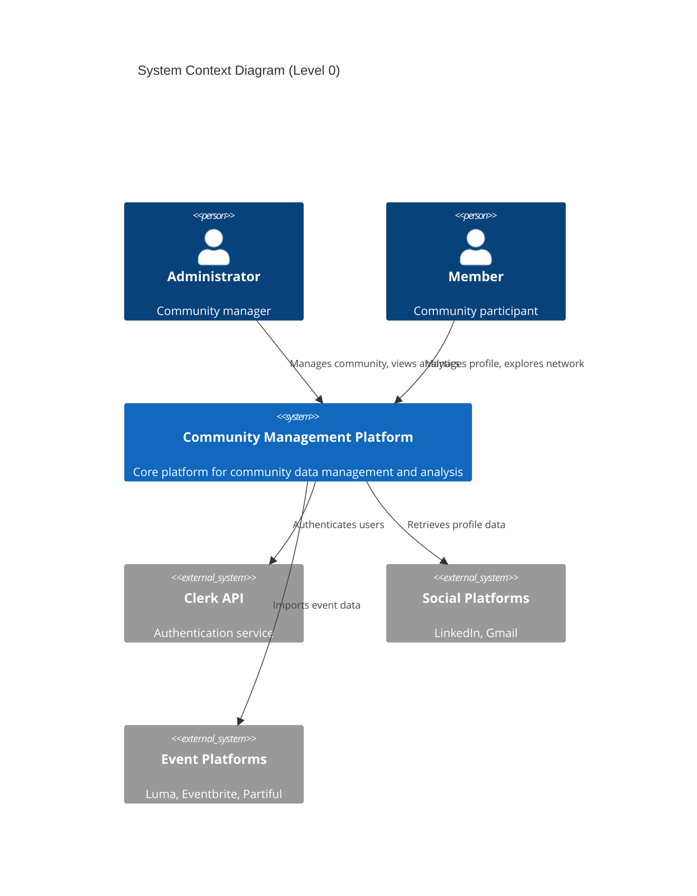

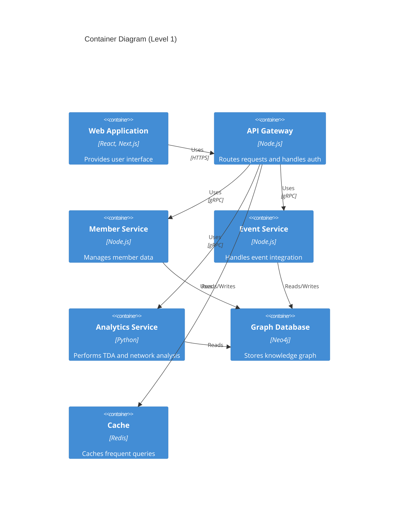

## 2.2 Component Details

### 2.2.1 Web Application
| Aspect | Details |
|--------|---------|
| Technology Stack | React, Next.js, Framer Motion |
| Key Features | Admin/Member dashboards, Network visualization, TDA interface |
| Data Flow | REST/GraphQL to API Gateway |
| Scaling | Static file distribution via CDN |

### 2.2.2 API Gateway
| Aspect | Details |
|--------|---------|
| Technology Stack | Node.js, Express |
| Key Features | Authentication, request routing, rate limiting |
| Interfaces | REST, GraphQL, WebSocket |
| Scaling | Horizontal via load balancer |

### 2.2.3 Member Service
| Aspect | Details |
|--------|---------|
| Technology Stack | Node.js, gRPC |
| Key Features | Profile management, entity disambiguation |
| Data Store | Graph Database (Neo4j) |
| Scaling | Horizontal with session affinity |

### 2.2.4 Event Service
| Aspect | Details |
|--------|---------|
| Technology Stack | Node.js, gRPC |
| Key Features | Event integration, data normalization |
| Data Store | Graph Database (Neo4j) |
| Scaling | Horizontal with queue-based processing |

### 2.2.5 Analytics Service
| Aspect | Details |
|--------|---------|
| Technology Stack | Python, NumPy, NetworkX |
| Key Features | TDA computation, network analysis |
| Data Store | Read-only graph access |
| Scaling | Vertical for computation intensity |

## 2.3 Technical Decisions

### 2.3.1 Architecture Style
| Decision | Rationale |
|----------|-----------|
| Microservices | Enables independent scaling and deployment |
| Event-Driven | Handles asynchronous data processing efficiently |
| API Gateway | Centralizes authentication and routing |

### 2.3.2 Data Storage
| Component | Solution | Justification |
|-----------|----------|---------------|
| Primary Store | Neo4j | Optimized for graph queries and relationships |
| Cache | Redis | In-memory performance for frequent queries |
| File Storage | S3 | Scalable storage for imported files |

### 2.3.3 Communication Patterns
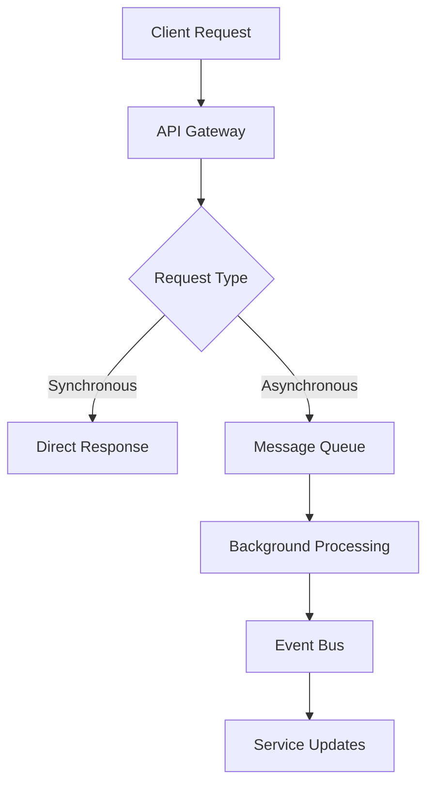

## 2.4 Cross-Cutting Concerns

### 2.4.1 Monitoring and Observability
| Component | Tool | Metrics |
|-----------|------|---------|
| APM | New Relic | Response times, error rates |
| Metrics | Prometheus | System resources, custom metrics |
| Dashboards | Grafana | Real-time monitoring |

### 2.4.2 Security Architecture
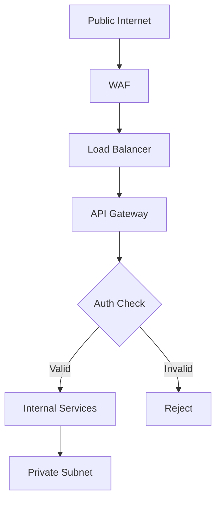

## 2.5 Deployment Architecture

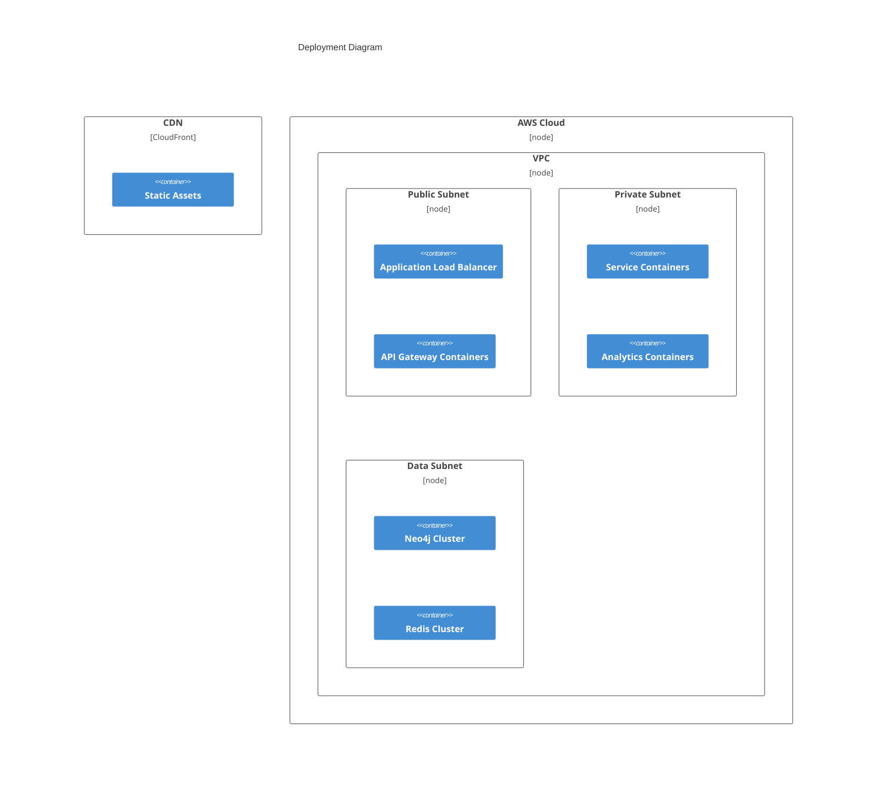

# 3. SYSTEM COMPONENTS ARCHITECTURE

## 3.1 USER INTERFACE DESIGN

### 3.1.1 Design Specifications

| Aspect | Requirement |
|--------|-------------|
| Visual Hierarchy | Material Design 3.0 principles with custom theming |
| Component Library | Custom React components built on Framer Motion |
| Responsive Design | Mobile-first, breakpoints at 320px, 768px, 1024px, 1440px |
| Accessibility | WCAG 2.1 Level AA compliance |
| Browser Support | Chrome 90+, Firefox 88+, Safari 14+, Edge 90+ |
| Theme Support | Dark/Light mode with system preference detection |
| Internationalization | English only for initial release |

### 3.1.2 Interface Elements

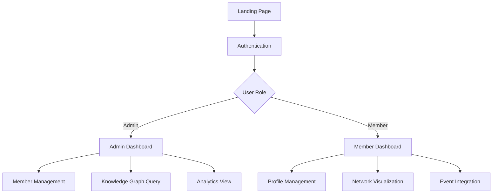

#### Critical User Flows

| Flow | Components | Validation Rules |
|------|------------|------------------|
| Authentication | Login Form, Social Buttons | Email format, OAuth token validation |
| Profile Setup | Profile Form, Social Links | Required fields, URL validation |
| Event Import | File Upload, API Connection | File size limits, format validation |
| Graph Query | Query Builder, Results View | Query complexity limits, timeout rules |

### 3.1.3 Component States

| State | Visual Indicator | Interaction Rules |
|-------|-----------------|-------------------|
| Loading | Skeleton screens with Framer Motion | Disable interactions |
| Error | Toast notifications, inline validation | Auto-dismiss after 5s |
| Empty | Illustrated empty states | Show onboarding hints |
| Success | Success animations, confirmations | Fade out after 3s |

## 3.2 DATABASE DESIGN

### 3.2.1 Schema Design

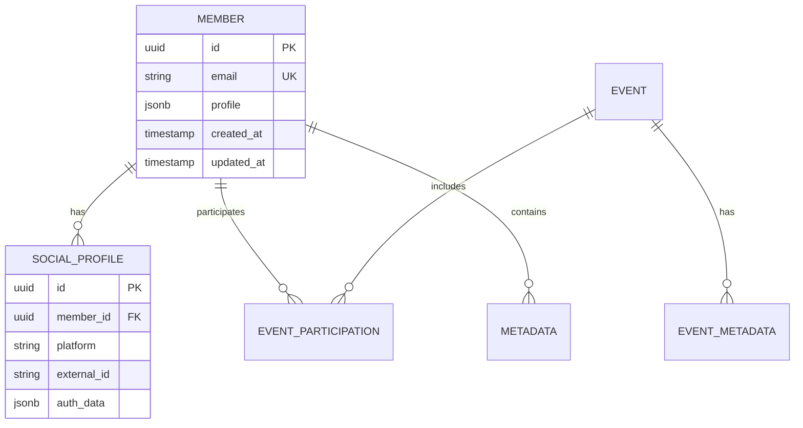

### 3.2.2 Graph Model

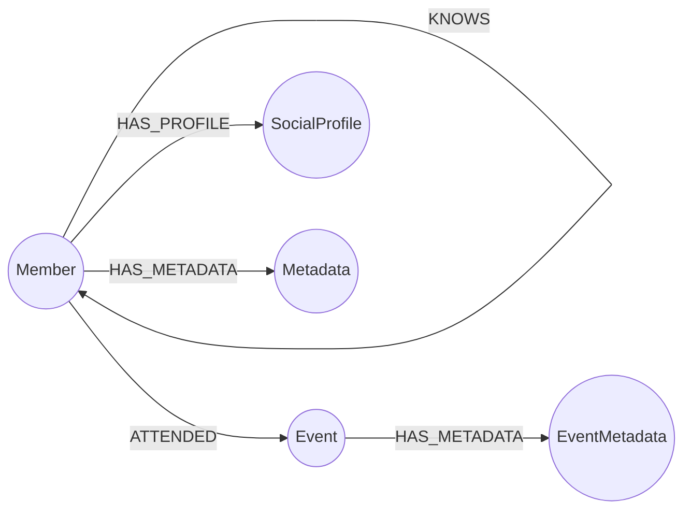

### 3.2.3 Data Management Strategy

| Aspect | Implementation |
|--------|----------------|
| Versioning | Graph edge versioning with temporal properties |
| Archival | Cold storage after 2 years of inactivity |
| Retention | 7-year retention for all member data |
| Privacy | PII encryption, GDPR compliance tools |
| Audit | Change tracking on all graph mutations |

## 3.3 API DESIGN

### 3.3.1 API Architecture

| Component | Specification |
|-----------|---------------|
| Protocol | REST + GraphQL |
| Authentication | JWT via Clerk API |
| Rate Limiting | 1000 req/hour per user |
| Versioning | URI versioning (v1) |
| Documentation | OpenAPI 3.0 |

### 3.3.2 API Flow

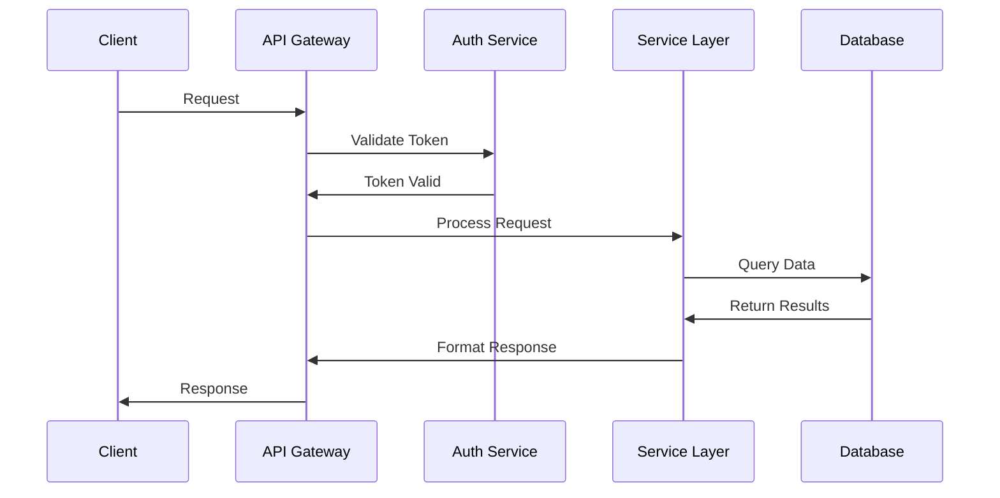

### 3.3.3 Integration Specifications

| Integration | Method | Authentication |
|-------------|--------|----------------|
| Luma | REST API | OAuth 2.0 |
| Eventbrite | REST API | API Key |
| Partiful | REST API | Bearer Token |
| LinkedIn | OAuth 2.0 | JWT |
| Gmail | OAuth 2.0 | JWT |

### 3.3.4 Error Handling

| Error Category | HTTP Status | Response Format |
|----------------|-------------|-----------------|
| Validation | 400 | {error: string, fields: object} |
| Authentication | 401 | {error: string, code: string} |
| Authorization | 403 | {error: string, required: string[]} |
| Not Found | 404 | {error: string, resource: string} |
| Rate Limit | 429 | {error: string, retry_after: number} |

# 4. TECHNOLOGY STACK

## 4.1 PROGRAMMING LANGUAGES

| Platform/Component | Language | Version | Justification |
|-------------------|----------|---------|---------------|
| Frontend | TypeScript | 5.0+ | Type safety, better IDE support for complex graph operations |
| API Gateway | Node.js | 18 LTS | Event-driven architecture, excellent async handling |
| Member/Event Services | Node.js | 18 LTS | Consistent backend ecosystem, gRPC support |
| Analytics Service | Python | 3.11+ | Superior scientific computing libraries, TDA tools |
| Database Scripts | Python | 3.11+ | Rich graph processing libraries, Neo4j drivers |

## 4.2 FRAMEWORKS & LIBRARIES

### 4.2.1 Frontend Framework Stack

| Component | Technology | Version | Purpose |
|-----------|------------|---------|----------|
| Core Framework | Next.js | 13+ | Server-side rendering, API routes |
| UI Framework | React | 18+ | Component-based architecture |
| Animation | Framer Motion | 10+ | Complex graph visualizations |
| State Management | React Query | 4+ | Server state management |
| Graph Visualization | D3.js | 7+ | Network graph rendering |
| Styling | Tailwind CSS | 3+ | Utility-first styling |

### 4.2.2 Backend Framework Stack

| Component | Technology | Version | Purpose |
|-----------|------------|---------|----------|
| API Gateway | Express.js | 4.18+ | REST/GraphQL endpoint handling |
| GraphQL | Apollo Server | 4+ | Graph query interface |
| Analytics | NumPy | 1.24+ | Numerical computations |
| Analytics | NetworkX | 3+ | Network analysis |
| Entity Processing | spaCy | 3.5+ | NLP for entity disambiguation |
| API Documentation | OpenAPI | 3.0 | API specification |

## 4.3 DATABASES & STORAGE

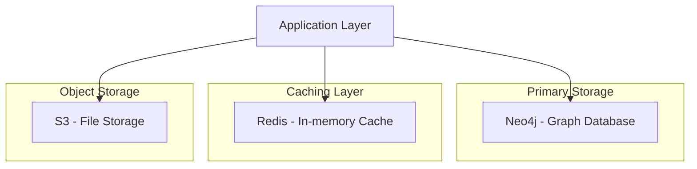

### 4.3.1 Database Solutions

| Type | Technology | Version | Usage |
|------|------------|---------|--------|
| Graph Database | Neo4j Enterprise | 5+ | Primary data store |
| Cache | Redis Enterprise | 7+ | Query/session caching |
| Object Storage | AWS S3 | - | File/import storage |
| Search | Elasticsearch | 8+ | Full-text search |

## 4.4 THIRD-PARTY SERVICES

| Category | Service | Purpose | Integration Method |
|----------|---------|---------|-------------------|
| Authentication | Clerk | User authentication | REST API |
| Event Integration | Luma | Event data | REST API |
| Event Integration | Eventbrite | Event data | REST API |
| Event Integration | Partiful | Event data | REST API |
| Social | LinkedIn | Profile data | OAuth 2.0 |
| Social | Gmail | Profile data | OAuth 2.0 |
| Monitoring | New Relic | APM | Agent-based |
| Metrics | Prometheus | System metrics | Pull-based |
| Visualization | Grafana | Dashboards | API |

## 4.5 DEVELOPMENT & DEPLOYMENT

### 4.5.1 Development Environment

| Tool | Version | Purpose |
|------|---------|----------|
| Docker | 24+ | Containerization |
| Docker Compose | 2.20+ | Local development |
| pnpm | 8+ | Package management |
| ESLint | 8+ | Code linting |
| Prettier | 3+ | Code formatting |
| Jest | 29+ | Testing framework |
| Cypress | 12+ | E2E testing |

### 4.5.2 Deployment Pipeline

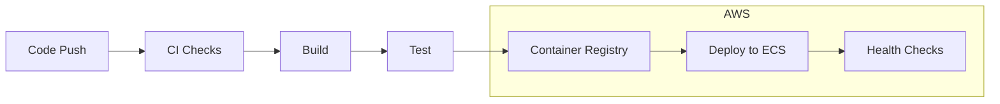

### 4.5.3 Infrastructure

| Component | Technology | Purpose |
|-----------|------------|----------|
| Cloud Platform | AWS | Primary infrastructure |
| Container Orchestration | ECS | Container management |
| Load Balancer | ALB | Traffic distribution |
| CDN | CloudFront | Static asset delivery |
| DNS | Route 53 | Domain management |
| SSL | ACM | Certificate management |
| IaC | Terraform | Infrastructure provisioning |

# 5. SYSTEM DESIGN

## 5.1 USER INTERFACE DESIGN

### 5.1.1 Admin Dashboard Layout

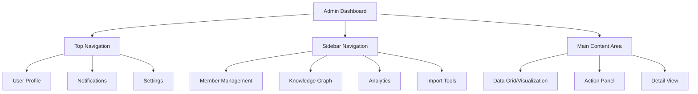

| Component | Description | Interactions |
|-----------|-------------|--------------|
| Knowledge Graph View | Interactive network visualization | Pan, zoom, node selection |
| Member Grid | Tabular view with filters | Sort, filter, bulk actions |
| TDA Controls | Parameter adjustment panel | Sliders, toggles, apply |
| Import Interface | File upload and API connection | Drag-drop, progress tracking |

### 5.1.2 Member Dashboard Layout

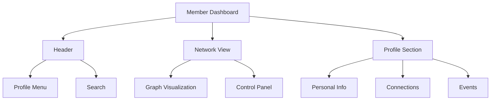

## 5.2 DATABASE DESIGN

### 5.2.1 Graph Schema

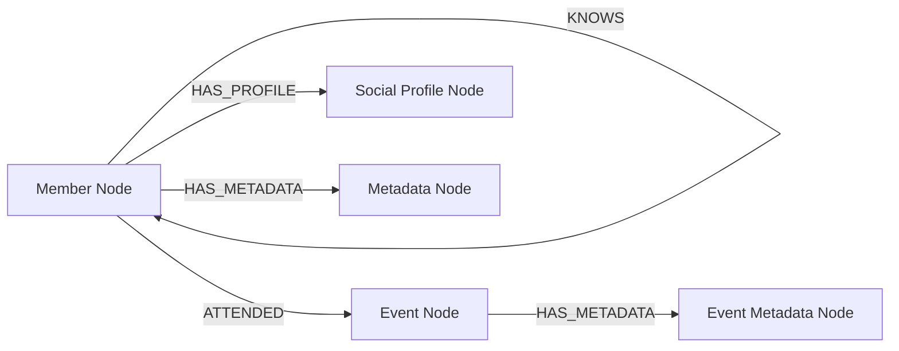

### 5.2.2 Node Properties

| Node Type | Properties | Indexes |
|-----------|------------|---------|
| Member | id, email, name, created_at | email, id |
| Event | id, name, date, platform | id, date |
| Social Profile | id, platform, external_id | external_id |
| Metadata | key, value, confidence | key |

### 5.2.3 Edge Properties

| Edge Type | Properties | Direction |
|-----------|------------|-----------|
| KNOWS | strength, last_interaction | Bidirectional |
| ATTENDED | role, timestamp | Member → Event |
| HAS_PROFILE | verified, last_sync | Member → Profile |
| HAS_METADATA | source, timestamp | Any → Metadata |

## 5.3 API DESIGN

### 5.3.1 REST Endpoints

| Endpoint | Method | Purpose |
|----------|--------|----------|
| /api/v1/members | GET, POST | Member management |
| /api/v1/events | GET, POST | Event operations |
| /api/v1/graph | GET | Knowledge graph queries |
| /api/v1/analytics | GET | TDA and network analysis |

### 5.3.2 GraphQL Schema

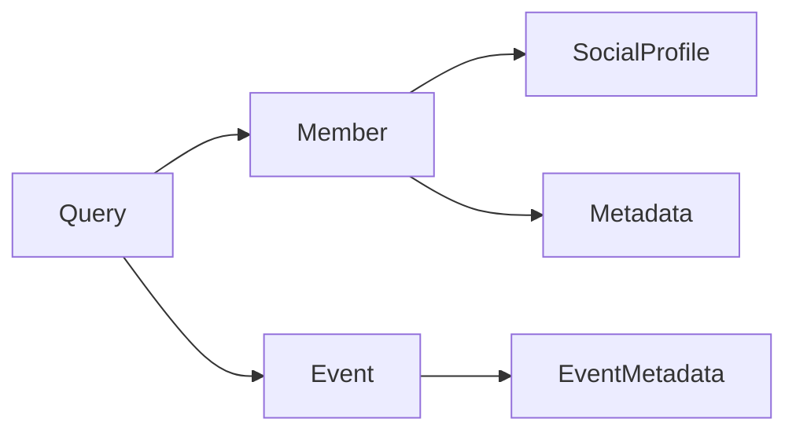

### 5.3.3 WebSocket Events

| Event | Direction | Purpose |
|-------|-----------|----------|
| graph.update | Server → Client | Real-time graph changes |
| analysis.complete | Server → Client | TDA computation results |
| import.progress | Server → Client | Import status updates |

### 5.3.4 Authentication Flow

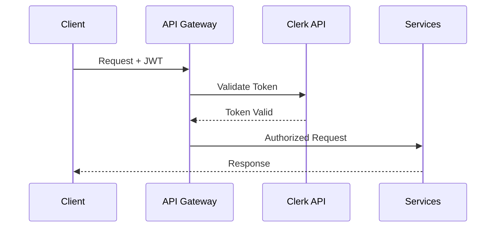

## 5.4 SYSTEM ARCHITECTURE

### 5.4.1 Component Interaction

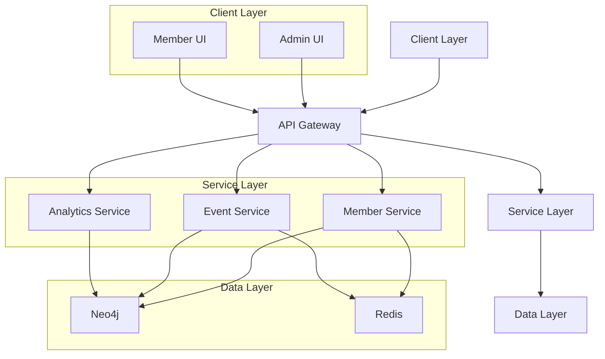

### 5.4.2 Data Flow

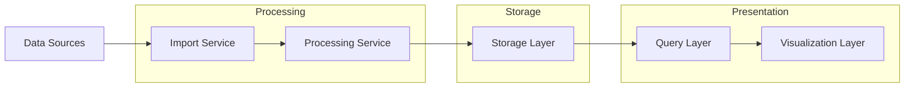

# 6. USER INTERFACE DESIGN

## 6.1 Common Elements

### Key/Legend
```
Icons:
[?] - Help/Info tooltip
[$] - Payment/Financial 
[i] - Information
[+] - Add/Create new
[x] - Close/Delete
[<] [>] - Navigation
[^] - Upload
[#] - Menu/Dashboard
[@] - User/Profile
[!] - Alert/Warning
[=] - Settings
[*] - Favorite/Important

Input Elements:
[ ] - Checkbox
( ) - Radio button
[...] - Text input field
[v] - Dropdown menu
[Button] - Clickable button
[====] - Progress bar

Layout:
+---+ - Container border
|   | - Container walls
+--  - Tree/hierarchy
```

## 6.2 Admin Dashboard

### 6.2.1 Main Navigation
```
+--------------------------------------------------------+
|  Community Platform [#]                          [@] [=] |
+--------------------------------------------------------+
|  +------------------+  +----------------------------+   |
|  | [#] Dashboard    |  |  Welcome back, Admin       |   |
|  | [*] Members      |  |                           |   |
|  | [@] Profiles     |  |  Quick Stats:             |   |
|  | [$] Events       |  |  Members: 1,245           |   |
|  | [?] Analytics    |  |  Events: 89               |   |
|  | [=] Settings     |  |  Active Now: 32           |   |
|  +------------------+  +----------------------------+   |
+--------------------------------------------------------+
```

### 6.2.2 Knowledge Graph Query Interface
```
+--------------------------------------------------------+
|  Knowledge Graph Query                           [?] [x] |
+--------------------------------------------------------+
|  Query Builder:                                         |
|  +--------------------------------------------------+ |
|  | SELECT                                            | |
|  | [v] Member --> [v] Event --> [v] Member          | |
|  | WHERE                                            | |
|  | [...Member.location = "San Francisco"...]        | |
|  +--------------------------------------------------+ |
|                                                        |
|  [Execute Query] [Save Query] [Clear]                  |
|                                                        |
|  Results:                                             |
|  +--------------------------------------------------+ |
|  | Visualization Area                                | |
|  | (Framer Motion Interactive Graph)                 | |
|  |                                                   | |
|  |                                                   | |
|  +--------------------------------------------------+ |
+--------------------------------------------------------+
```

## 6.3 Member Dashboard

### 6.3.1 Profile View
```
+--------------------------------------------------------+
|  My Profile                                    [@] [=]   |
+--------------------------------------------------------+
|  +-------------------+  +-------------------------+      |
|  |    [@]           |  | Profile Information     |      |
|  |  John Doe        |  | [...Name............]  |      |
|  |  San Francisco   |  | [...Email...........]  |      |
|  |                  |  | [...Location........]  |      |
|  |  [Edit Photo]    |  |                        |      |
|  +-------------------+  | Connected Accounts:    |      |
|                        | [x] LinkedIn Connected  |      |
|                        | [ ] Gmail Connect       |      |
|                        |                        |      |
|                        | [Save Changes]         |      |
|                        +-------------------------+      |
+--------------------------------------------------------+
```

### 6.3.2 Network Visualization
```
+--------------------------------------------------------+
|  My Network                                  [?] [=]     |
+--------------------------------------------------------+
|  Filters:                                               |
|  [v] Connection Type  [v] Time Period  [Search...]      |
|                                                         |
|  +--------------------------------------------------+ |
|  |                                                   | |
|  |          Interactive Network Graph                | |
|  |          (Framer Motion Enabled)                 | |
|  |                                                  | |
|  |          [+] Zoom In  [-] Zoom Out              | |
|  |          [Pan] [Center] [Fit]                   | |
|  |                                                  | |
|  +--------------------------------------------------+ |
|                                                        |
|  Selected Node Details:                               |
|  +--------------------------------------------------+ |
|  | Name: Jane Smith                                  | |
|  | Events in Common: 3                               | |
|  | Connection Strength: High                         | |
|  +--------------------------------------------------+ |
+--------------------------------------------------------+
```

### 6.3.3 Event Integration Panel
```
+--------------------------------------------------------+
|  Event Import                                    [?] [x] |
+--------------------------------------------------------+
|  Import Sources:                                        |
|  +--------------------------------------------------+ |
|  | [x] Luma       [Connect Account]                  | |
|  | [ ] Eventbrite [Connect Account]                  | |
|  | [ ] Partiful   [Connect Account]                  | |
|  +--------------------------------------------------+ |
|                                                        |
|  Manual Import:                                        |
|  +--------------------------------------------------+ |
|  | [^] Drag and drop CSV file or click to upload    | |
|  |                                                  | |
|  | [============================] 75% Complete      | |
|  |                                                  | |
|  | [Start Import] [Cancel]                         | |
|  +--------------------------------------------------+ |
|                                                        |
|  Recent Imports:                                       |
|  +--------------------------------------------------+ |
|  | > Tech Meetup 2023 (Success)                     | |
|  | > Startup Conference (Processing)                | |
|  | > [!] Developer Workshop (Failed)                | |
|  +--------------------------------------------------+ |
+--------------------------------------------------------+
```

### 6.3.4 TDA Control Panel
```
+--------------------------------------------------------+
|  Topological Analysis Controls                   [?] [x] |
+--------------------------------------------------------+
|  Parameters:                                            |
|  +--------------------------------------------------+ |
|  | Epsilon Value:                                    | |
|  | [====================O=====] 0.75                | |
|  |                                                  | |
|  | Minimum Points:                                  | |
|  | [===============O==========] 15                  | |
|  |                                                  | |
|  | Dimension:                                       | |
|  | ( ) 2D  (*) 3D                                  | |
|  |                                                  | |
|  | [Apply Changes] [Reset Defaults]                 | |
|  +--------------------------------------------------+ |
|                                                        |
|  Visualization:                                        |
|  +--------------------------------------------------+ |
|  |                                                  | |
|  |          TDA Output Visualization               | |
|  |          (Framer Motion Enabled)               | |
|  |                                                  | |
|  +--------------------------------------------------+ |
+--------------------------------------------------------+
```

## 6.4 Responsive Design Breakpoints

| Breakpoint | Width | Layout Adjustments |
|------------|-------|-------------------|
| Mobile | 320px | Single column, stacked navigation |
| Tablet | 768px | Two column, collapsed sidebar |
| Desktop | 1024px | Full layout with sidebars |
| Wide | 1440px | Extended visualization area |

## 6.5 Component States

| Component | States |
|-----------|--------|
| Buttons | Default, Hover, Active, Disabled |
| Inputs | Empty, Focused, Filled, Error, Success |
| Navigation | Default, Active, Collapsed |
| Visualizations | Loading, Interactive, Error |
| Progress Bars | Empty, Partial, Complete, Error |

# 7. SECURITY CONSIDERATIONS

## 7.1 AUTHENTICATION AND AUTHORIZATION

### 7.1.1 Authentication Flow

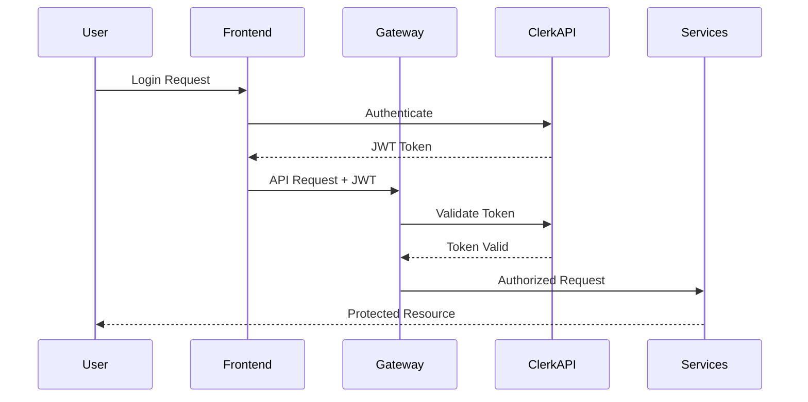

### 7.1.2 Authorization Matrix

| Role | Member Management | Knowledge Graph | Analytics | System Config |
|------|------------------|-----------------|-----------|---------------|
| Admin | Full Access | Full Access | Full Access | Full Access |
| Member | Self Only | Read Only | Limited Access | No Access |
| Analyst | Read Only | Full Access | Full Access | No Access |
| Guest | No Access | No Access | No Access | No Access |

### 7.1.3 Session Management

| Feature | Implementation |
|---------|---------------|
| Token Type | JWT with RS256 |
| Token Lifetime | 1 hour |
| Refresh Token | 7 days |
| Session Timeout | 30 minutes inactive |
| Concurrent Sessions | Limited to 3 |

## 7.2 DATA SECURITY

### 7.2.1 Encryption Standards

| Data State | Method | Standard |
|------------|--------|-----------|
| At Rest | AES | 256-bit |
| In Transit | TLS | 1.3 |
| Database | Field-level | AES-256-GCM |
| Backups | Full encryption | AES-256 |

### 7.2.2 Data Classification

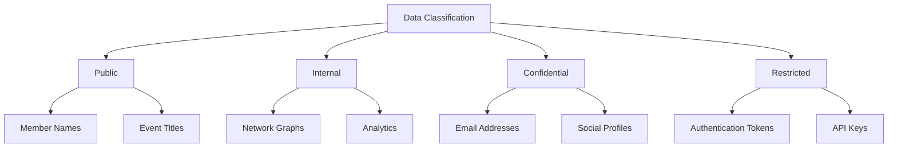

### 7.2.3 PII Protection

| Data Type | Protection Method | Access Control |
|-----------|------------------|----------------|
| Email | Hashed & Encrypted | Role-Based |
| Social IDs | Encrypted | Service Account Only |
| Location | Anonymized | Aggregated Only |
| Profile Data | Encrypted | Owner + Admin |

## 7.3 SECURITY PROTOCOLS

### 7.3.1 API Security

| Measure | Implementation |
|---------|---------------|
| Rate Limiting | 100 requests/minute per IP |
| Input Validation | Server-side validation with JSON Schema |
| CORS | Whitelist of approved domains |
| API Keys | Rotated every 30 days |
| Request Signing | HMAC SHA-256 |

### 7.3.2 Infrastructure Security

```mermaid
flowchart TD
    A[Internet] --> B[WAF]
    B --> C[Load Balancer]
    C --> D[API Gateway]
    D --> E{Auth Check}
    E -->|Valid| F[Private Services]
    E -->|Invalid| G[Reject]
    
    subgraph Private Network
    F --> H[Database]
    F --> I[Cache]
    end
```

### 7.3.3 Security Monitoring

| Component | Tool | Metrics |
|-----------|------|---------|
| Access Logs | CloudWatch | Login attempts, failures |
| API Usage | New Relic | Request patterns, anomalies |
| System Health | Prometheus | Resource usage, threats |
| Vulnerabilities | Snyk | Dependency scanning |
| Code Security | SonarQube | Static analysis |

### 7.3.4 Incident Response

| Phase | Actions | Timeframe |
|-------|---------|-----------|
| Detection | Automated alerts, Log analysis | Real-time |
| Containment | Service isolation, Token revocation | < 15 minutes |
| Eradication | Patch deployment, Configuration updates | < 2 hours |
| Recovery | Service restoration, Data validation | < 4 hours |
| Review | Incident documentation, Process updates | < 24 hours |

### 7.3.5 Compliance Controls

| Requirement | Implementation |
|-------------|---------------|
| GDPR | Data minimization, Right to erasure |
| CCPA | Privacy controls, Data portability |
| SOC 2 | Audit logging, Access reviews |
| OWASP | Security headers, CSP implementation |
| PCI DSS | Token vaulting, Encryption standards |

# 8. INFRASTRUCTURE

## 8.1 DEPLOYMENT ENVIRONMENT

The system will be deployed entirely on cloud infrastructure to maximize scalability, reliability and maintainability.

| Environment | Purpose | Configuration |
|-------------|---------|---------------|
| Development | Local development and testing | Docker Compose with local services |
| Staging | Pre-production testing | AWS with reduced capacity |
| Production | Live environment | AWS with auto-scaling |
| DR | Disaster recovery | AWS secondary region |

## 8.2 CLOUD SERVICES

### 8.2.1 AWS Service Architecture

```mermaid
flowchart TD
    A[Route 53] --> B[CloudFront]
    B --> C[ALB]
    C --> D[ECS Cluster]
    D --> E[ECS Services]
    E --> F[RDS]
    E --> G[ElastiCache]
    E --> H[S3]
    
    subgraph Compute
    D
    E
    end
    
    subgraph Storage
    F[Neo4j Enterprise]
    G[Redis Enterprise]
    H[Object Storage]
    end
```

### 8.2.2 AWS Services Selection

| Service | Purpose | Justification |
|---------|---------|---------------|
| ECS | Container orchestration | Lower complexity than EKS, suitable for scale |
| ALB | Load balancing | Native container integration, WebSocket support |
| CloudFront | CDN | Global distribution of static assets |
| RDS | Database hosting | Managed Neo4j Enterprise deployment |
| ElastiCache | Redis caching | Managed Redis with automatic failover |
| S3 | Object storage | Scalable storage for imports/exports |
| Route 53 | DNS management | High availability DNS with health checks |

## 8.3 CONTAINERIZATION

### 8.3.1 Container Architecture

```mermaid
graph TD
    A[Base Image] --> B[Node.js Base]
    A --> C[Python Base]
    B --> D[API Gateway]
    B --> E[Member Service]
    B --> F[Event Service]
    C --> G[Analytics Service]
    
    subgraph Images
    A
    B
    C
    end
    
    subgraph Services
    D
    E
    F
    G
    end
```

### 8.3.2 Docker Configuration

| Component | Base Image | Exposed Ports | Resource Limits |
|-----------|------------|---------------|-----------------|
| API Gateway | node:18-alpine | 3000 | 1CPU, 2GB RAM |
| Member Service | node:18-alpine | 4000 | 1CPU, 2GB RAM |
| Event Service | node:18-alpine | 4001 | 1CPU, 2GB RAM |
| Analytics Service | python:3.11-slim | 5000 | 2CPU, 4GB RAM |

## 8.4 ORCHESTRATION

### 8.4.1 ECS Configuration

| Service | Tasks | Auto-scaling Rules | Health Check |
|---------|-------|-------------------|--------------|
| API Gateway | 2-6 | CPU > 70%, Memory > 80% | /health, 30s |
| Member Service | 2-4 | Request Count > 1000/min | /health, 30s |
| Event Service | 2-4 | Queue Length > 100 | /health, 30s |
| Analytics Service | 1-2 | CPU > 80% | /health, 60s |

### 8.4.2 Service Discovery

```mermaid
flowchart LR
    A[Service Discovery] --> B[API Gateway]
    A --> C[Member Service]
    A --> D[Event Service]
    A --> E[Analytics Service]
    
    B --> F[Internal ALB]
    C --> F
    D --> F
    E --> F
```

## 8.5 CI/CD PIPELINE

### 8.5.1 Pipeline Architecture

```mermaid
flowchart LR
    A[GitHub] --> B[GitHub Actions]
    B --> C{Tests Pass?}
    C -->|Yes| D[Build Images]
    C -->|No| E[Notify Team]
    D --> F[Push to ECR]
    F --> G[Deploy to Staging]
    G --> H{Staging Tests Pass?}
    H -->|Yes| I[Deploy to Prod]
    H -->|No| E
```

### 8.5.2 Pipeline Stages

| Stage | Tools | Actions | SLA |
|-------|-------|---------|-----|
| Code Analysis | SonarQube | Static analysis, security scan | < 5 min |
| Unit Tests | Jest, Pytest | Run test suites | < 10 min |
| Build | Docker | Build and tag images | < 15 min |
| Security Scan | Snyk | Container vulnerability scan | < 10 min |
| Staging Deploy | Terraform | Infrastructure updates | < 20 min |
| Integration Tests | Cypress | E2E testing | < 30 min |
| Production Deploy | Terraform | Blue-green deployment | < 30 min |

### 8.5.3 Deployment Strategy

| Environment | Strategy | Rollback Time | Monitoring Period |
|-------------|----------|---------------|-------------------|
| Staging | Direct deployment | Immediate | 15 minutes |
| Production | Blue-green | < 5 minutes | 1 hour |
| DR | Region failover | < 15 minutes | 24 hours |

# 9. APPENDICES

## 9.1 ADDITIONAL TECHNICAL INFORMATION

### 9.1.1 Entity Disambiguation Process Flow

```mermaid
flowchart TD
    A[Raw Entity Data] --> B[NLP Processing]
    B --> C[Entity Extraction]
    C --> D{Disambiguation Required?}
    D -->|Yes| E[Context Analysis]
    D -->|No| H[Direct Mapping]
    E --> F[Candidate Generation]
    F --> G[Score & Rank]
    G --> I[Select Best Match]
    H --> J[Knowledge Graph Update]
    I --> J
```

### 9.1.2 TDA Parameter Configuration

| Parameter | Range | Default | Impact |
|-----------|-------|---------|---------|
| Epsilon | 0.1-1.0 | 0.5 | Determines neighborhood size |
| MinPoints | 5-50 | 15 | Affects cluster density |
| Dimension | 2-3 | 2 | Visualization dimensionality |
| Persistence | 0.1-0.9 | 0.3 | Feature significance threshold |
| Distance Metric | euclidean, manhattan, cosine | euclidean | Similarity measurement |

## 9.2 GLOSSARY

| Term | Definition |
|------|------------|
| Entity Resolution | Process of determining whether two entity references refer to the same real-world entity |
| Graph Embedding | Mathematical representation of a graph in vector space while preserving structural information |
| Knowledge Graph Query | Structured query to traverse and retrieve information from interconnected graph data |
| Persistence Diagram | Visual representation of topological features and their lifetimes in TDA |
| Semantic Distance | Measure of semantic similarity between entities in the embedding space |
| Social Graph | Network representation of social relationships between community members |
| Topological Feature | Structural characteristic identified through TDA analysis |

## 9.3 ACRONYMS

| Acronym | Full Form |
|---------|-----------|
| ALB | Application Load Balancer |
| APM | Application Performance Monitoring |
| CDN | Content Delivery Network |
| CSP | Content Security Policy |
| ECS | Elastic Container Service |
| gRPC | Google Remote Procedure Call |
| IaC | Infrastructure as Code |
| RBAC | Role-Based Access Control |
| S3 | Simple Storage Service |
| SLA | Service Level Agreement |
| SSL | Secure Sockets Layer |
| TDA | Topological Data Analysis |
| VPC | Virtual Private Cloud |
| WAF | Web Application Firewall |

## 9.4 REFERENCE ARCHITECTURE

```mermaid
flowchart TD
    A[Client Layer] --> B[CDN/WAF]
    B --> C[Load Balancer]
    C --> D[Application Layer]
    D --> E[Service Layer]
    E --> F[Data Layer]
    
    subgraph Client Layer
    A1[Admin UI]
    A2[Member UI]
    end
    
    subgraph Application Layer
    D1[Next.js SSR]
    D2[API Gateway]
    end
    
    subgraph Service Layer
    E1[Member Service]
    E2[Event Service]
    E3[Analytics Service]
    end
    
    subgraph Data Layer
    F1[Neo4j]
    F2[Redis]
    F3[S3]
    end
```

## 9.5 PERFORMANCE BENCHMARKS

| Operation | Target Response Time | Max Load | Degradation Point |
|-----------|---------------------|-----------|-------------------|
| Graph Query (Simple) | < 200ms | 1000 qps | 2000 qps |
| Graph Query (Complex) | < 1s | 100 qps | 200 qps |
| Entity Disambiguation | < 500ms | 50 rps | 100 rps |
| TDA Computation | < 5s | 10 rps | 20 rps |
| Event Import | < 30s | 5 rps | 10 rps |
| Network Visualization | < 2s | 100 rps | 200 rps |